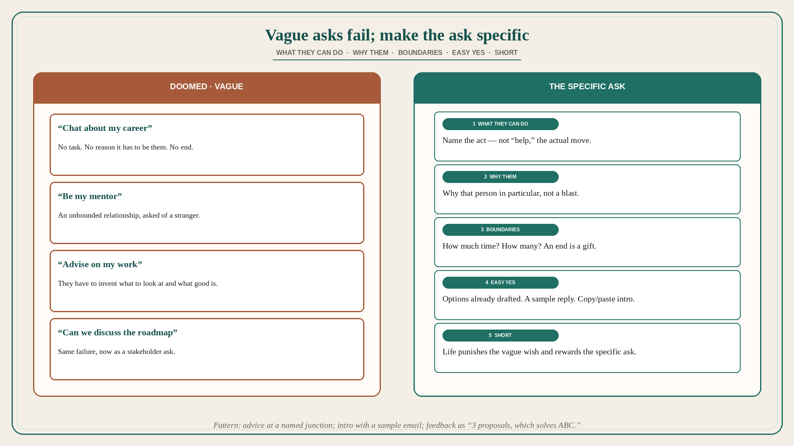

# Vague asks fail; name what, why them, boundaries, and an easy yes

**Source:** Julie Zhuo (@joulee)
**Post:** https://x.com/joulee/status/1557385037812682753

## What it claims

Want someone’s help? If you do not know them well, vague asks are doomed to fail: will you chat with me about my career; will you be my mentor; will you give me advice on how to improve my work. Instead, make the asks specific. Better (still not amazing): can I walk through my thinking on a big career decision; can you connect me with some folks who are experts in XYZ; will you do a portfolio review with me. Best way to ask: (1) explain specifically what the person can do to help; (2) explain why you are asking that person in particular; (3) explain the boundaries (how much time? how many?); (4) make it as easy as possible for them to say yes; (5) make the ask short and sweet. Examples — advice: I have long admired your career and I find myself at a similar junction; I would love whatever advice you might have on how to think through joining a start-up after years at a large company. Intro: I noticed you are connected to A, B, and C through XYZ; would you connect me regarding a named topic? I am keen because of a named reason. Here is a sample email you can copy/paste. Feedback on work: I am struggling with a product decision for X, particularly how to balance Y with Z. Here are 3 proposals I have tried — which feels most effective for solving problem ABC? Closing: “Life punishes the vague wish and rewards the specific ask.” — Tim Ferriss.

## Why it matters for a PO

Stakeholder asks are often the vague set: “can we chat about the roadmap,” “can you support this,” “any feedback on the increment.” Same failure mode. A PO who will name what they need the person to do, why them, time/count boundaries, and an easy yes (options already drafted, sample reply) is using career hygiene as PI hygiene. “Be my mentor / look at this” wastes the only slot you will get.

## 3 takeaways

1. Vague asks (chat about career / be my mentor / advise on my work) fail with people you do not know well.
2. Best ask: what they can do, why them, boundaries (time/count), make yes easy, keep it short.
3. Pattern: advice at a named junction; intro with sample email; feedback as “3 proposals, which solves ABC.”

## Practice this week

Rewrite one vague stakeholder ask using Zhuo’s five. Include boundaries and an easy yes (two options, or a sample reply). Do not send “can we find time to discuss the roadmap.”
