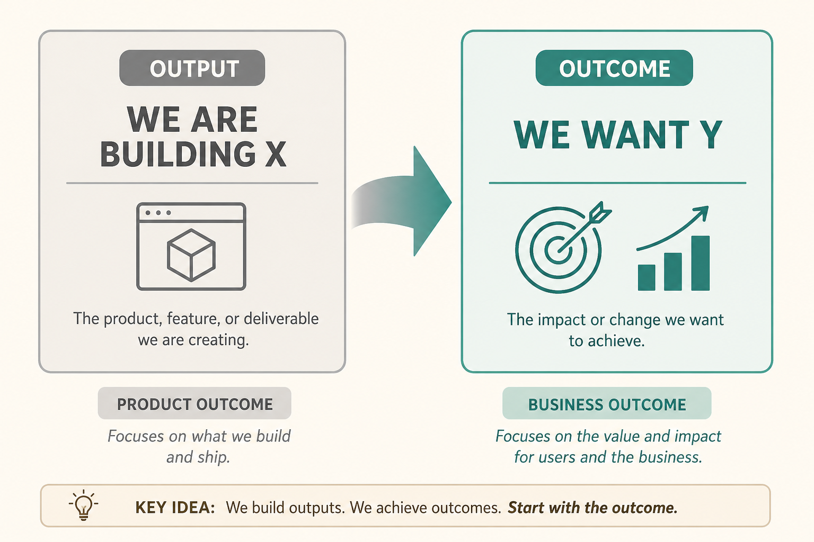

# OKRs are a format; the work is choosing the right outcome

**Source:** Teresa Torres (@ttorres)
**Post:** https://x.com/ttorres/status/1609703614141849600

## What it claims

An outcome is the impact of actions. Flip “we’re building X to get Y” to “we want Y; how might we get there?” (sometimes build nothing). OKRs just express that: inspirational objective + quantitative KRs. Distinguish business outcomes (health of the business) from product outcomes (customer behavior the team can influence).

## Why it matters for a PO

Sprint commitments on features hide whether anyone’s behavior changed. Product KRs keep the team on leading indicators they actually own.

## 3 takeaways

1. Start from Y, not from X.
2. Business OKRs ≠ product OKRs.
3. Picking which outcome matters is the hard work; formatting is easy.

## Practice this week

Rewrite this quarter’s top KR as a product outcome (% of users who do behavior Z weekly). If you cannot name the behavior, the KR is still an output.
