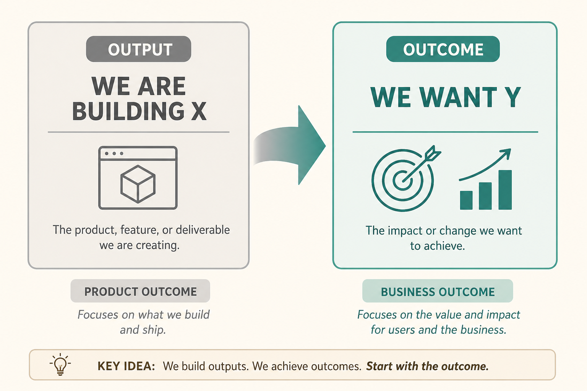

---
filters:
  topic:
    - metrics-analytics
    - roadmaps-prioritization
  format: principle
  source: teresa-torres
---

# OKRs are a format; the work is choosing the right outcome

**Source:** Teresa Torres (@ttorres)
**Post:** https://x.com/ttorres/status/1609703614141849600

## What it claims

An outcome is the impact of actions. Flip “we’re building X to get Y” to “we want Y; how might we get there?” (sometimes build nothing). OKRs just express that: inspirational objective + quantitative KRs. Distinguish business outcomes (health of the business) from product outcomes (customer behavior the team can influence).

## Why it matters for a PO

Sprint commitments on features hide whether anyone’s behavior changed. Product KRs keep the team on leading indicators they actually own.

## 3 takeaways

1. Start from Y, not from X.
2. Business OKRs ≠ product OKRs.
3. Picking which outcome matters is the hard work; formatting is easy.

## Practice this week

Rewrite this quarter’s top KR as a product outcome (% of users who do behavior Z weekly). If you cannot name the behavior, the KR is still an output.

## Also from

- **Pavel A. Samsonov (@PavelASamsonov)**, [original post](https://x.com/PavelASamsonov/status/1569366431975804928) (merged from lesson 134): Output-first planning makes the present clearer than the future (Q1 stories, Q4 feature fog). Outcome-first planning makes the future clearer than the present (Q4 goals are set; Q1 is spent finding paths). The outcome plan looks vaguer but is more agile, because nothing ties the team to the next feature set after the first release. The usual gap is leaders not committing to an explicit strategy, not teams failing to write OKRs. Frame the north star as “today users have to X, now they can Y, and this is why it matters for the business,” and share goals with sister teams instead of trading roadmap slots.
