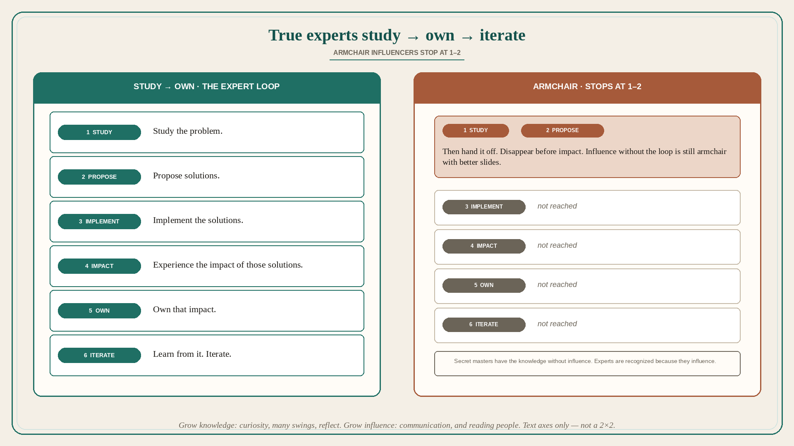

# True experts study → implement → own → iterate; armchair stops at 1–2

**Source:** Julie Zhuo (@joulee)
**Post:** https://x.com/joulee/status/1489271227457830915

## What it claims

True experts and secret masters have experience: (1) studying the problem; (2) proposing solutions; (3) implementing solutions; (4) experiencing the impact of their solutions; (5) owning that impact; (6) learning from and iterating on solutions. Armchair influencers stop at 1 or 2. The difference between true experts and secret masters: the former is influential and recognized by others; secret masters have the same substantive knowledge but do not have the desire or ability to influence. Students — to increase true knowledge: be curious; take many swings at actually solving problems; reflect to soak up your learnings. To increase influence: work on communication skills (writing, speaking); learn how to read and connect with people.

## Why it matters for a PO

PI theater is full of armchair: study + propose, then hand the story to the trio and disappear before impact. Secret-master POs have the judgment and will not influence. A PO who will stay through implement → experience impact → own it → iterate is the expert path. Influence without that loop is still armchair with better slides. Knowledge grows from curiosity, many swings, and reflection — not from one clever proposal.

## 3 takeaways

1. Expert loop: study → propose → implement → experience impact → own it → iterate. Armchair stops at study/propose.
2. Secret masters have the same knowledge without desire or ability to influence; experts are recognized because they influence.
3. Grow knowledge: curious, many swings, reflect. Grow influence: communication, and reading/connecting with people.

## Practice this week

Pick one item you have only studied/proposed. Stay with it through this increment’s impact: write what happened, own the miss or hit, name the next iteration. Do not add another proposal-only story until that loop has one pass. If you already know and cannot move the room, pick one communication artifact (a page, not a deck) and one person to actually read.
