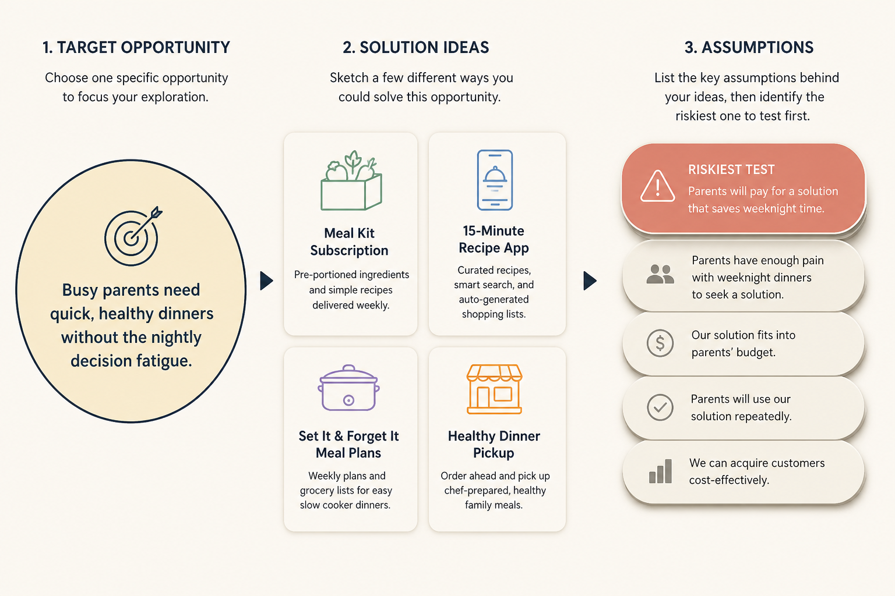

# Compare 3–4 solutions by testing assumptions, not by marrying idea #1

**Source:** Teresa Torres (@ttorres)
**Post:** https://x.com/ttorres/status/1605343574442364930

## What it claims

Escalation of commitment, confirmation bias, overconfidence, and delivery pressure make teams overcommit to the first idea. Strong teams clarify outcome + customer problem first, generate many targeted ideas, story-map 3–4, assumption-map risk, and assumption-test all week—not A/B the whole idea. Cagan: 10–20 idea tests/week is normal for strong teams.

## Why it matters for a PO

The PO is often the person who “already knows the story.” This is the operating cadence that stops a backlog from becoming a feature factory.

## 3 takeaways

1. Outcome and problem before solutions.
2. Don’t test whole ideas; test riskiest assumptions.
3. Compare-and-contrast beats sequential one-idea bets.

## Practice this week

Monday: one target opportunity, 10+ solution sketches, pick 3, list assumptions, test the riskiest one by Friday, then compare.
