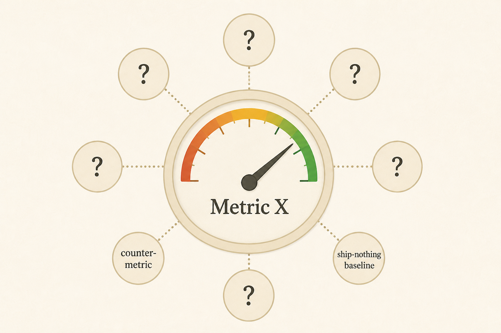

# Eight questions before you accept “move Metric X up Y%”

**Source:** Julie Zhuo (@joulee)
**Post:** https://x.com/joulee/status/1813263007763583393

## What it claims

Goals determine what you build. Metrics are proxies for the customer outcome. Stress-test: ideal customer outcome; false negatives; false positives (need counter-metrics); business materiality; the 15-minute alignment test; baseline if you shipped nothing; sensitivity for launch-level feedback; 50–70% confidence targets.

## Why it matters for a PO

Unquestioned KRs produce Goodhart games, unmemorable dashboards, and work that doesn’t move the business.

## 3 takeaways

1. Start from the customer outcome, then pick proxies.
2. Pair goal metrics with counter-metrics.
3. If the team can’t repeat the goals in 15 minutes, they won’t drive daily choices.

## Practice this week

Run the 8 questions on this half’s primary metric in a 45-minute trio meeting; add one counter-metric and a “ship nothing” forecast.
