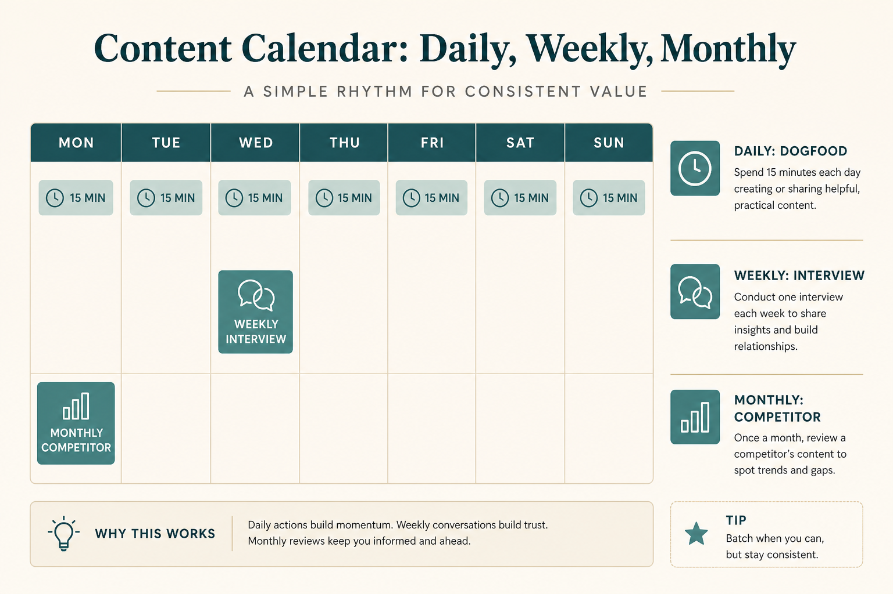

# Product intuition is a calendar habit, not a talent

**Source:** Julie Zhuo (@joulee)
**Post:** https://x.com/joulee/status/1638272462688518146

## What it claims

The only way she knows to build product intuition is: use the product as a real user, and continually research the customer. She lists 12 timed practices (daily dogfood 15 min, session replays, dashboard, weekly interviews/tickets/analysis, monthly competitor use and sales ride-alongs). Half the list ≈ 5% of the week.

## Why it matters for a PO

Prioritization and stakeholder debates collapse without firsthand product + customer contact. This is a PO operating system, not a research team luxury.

## 3 takeaways

1. Dogfood daily as a real user.
2. Mix live customers, tickets, data, and competitors.
3. 5–15% of the week is enough if it’s scheduled.

## Practice this week

Block 15 min/day dogfood + 30 min this week on one real customer workflow interview; write 3 intuition notes into the next refinement.
