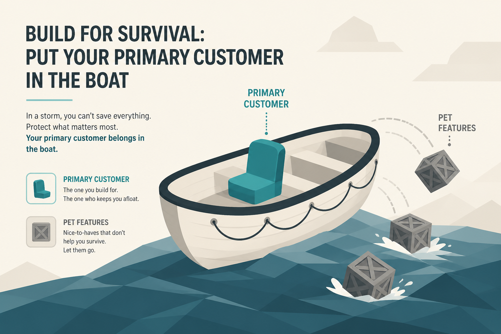

# Prioritize until it hurts: pick a customer, kill the dream, hunt the rest

**Source:** Julie Zhuo (@joulee)
**Post:** https://x.com/joulee/status/1626261906142150656

## What it claims

Real prioritization hurts: you pick favorites among users (Abbey vs Dwight); you dissolve the “X and Y and Z on a silver platter” dream; you throw pet features and niche requests out of the lifeboat; then you pursue the remainder with daily vigilance. The treasure is doing your best for the people who matter most.

## Why it matters for a PO

A “balanced” backlog that serves everyone is how nothing ships. This is the language for saying no in sprint planning.

## 3 takeaways

1. Name the primary customer and problem.
2. Cut loved-but-heavy items.
3. Once cut, execute the remainder like a hunt—no excuses.

## Practice this week

Write one sentence: “This sprint we are for [person] with [problem], not for [person].” Cut two backlog items that fail that sentence.
