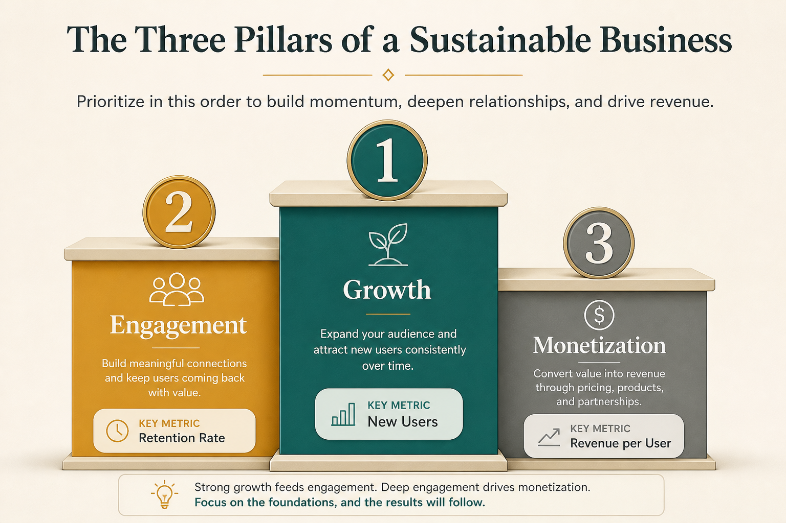

# GEM: force-rank Growth, Engagement, Monetization and give each a metric

**Source:** Gibson Biddle (@gibsonbiddle)
**Post:** https://x.com/gibsonbiddle/status/1483467593327468553

## What it claims

Cross-functional misalignment shows up as six different GEM rankings. Force-rank G/E/M, assign a metric each (growth = YoY users; engagement = product-quality proxy like DAU or monthly retention; monetization = LTV/ARPU). Rankings change (Chegg, Netflix, early Instagram). Re-debate every ~6 months and restate constantly.

## Why it matters for a PO

When finance wants LTV, growth wants acquisition, and product wants quality, the PO needs a shared rank to decide sprint tradeoffs.

## 3 takeaways

1. Six different ranks = misalignment.
2. Engagement is “what would we use to pick the A/B winner?”
3. Revisit GEM twice a year; lather-rinse-repeat the rank.

## Practice this week

Ask your PM, eng lead, design, and one exec to independently rank G/E/M and name a metric. Compare in 20 minutes; publish one team rank.
