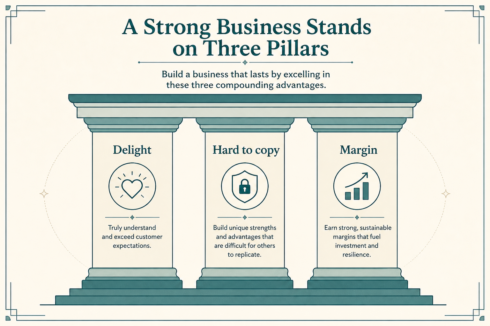

# DHM (and the rest of the stack): Delight, Hard-to-copy, Margin

**Source:** Gibson Biddle (@gibsonbiddle)
**Post:** https://x.com/gibsonbiddle/status/1331835529797672960

## What it claims

Product strategy is hypotheses: how will you Delight customers, make it Hard to copy, and Improve Margin? Then SMT (Strategy → proxy Metric → Tactics), GEM force-rank, a roadmap that stories tactics across four quarters, and a quarterly strategy meeting. GLEE is the 10–20 year Get-big / Lead / Expand vision.

## Why it matters for a PO

Backlog items should map to a DHM hypothesis, not “because a stakeholder asked.” Hard-to-copy and margin stop delight-only roadmaps that competitors clone.

## 3 takeaways

1. Strategy = DHM hypotheses, not a feature list.
2. Every strategy needs a proxy metric and tactics.
3. The roadmap is a story of those tactics over time.

## Practice this week

Take the next 5 sprint candidates. Tag each D, H, or M. Drop or reframe any item that is none of the three.
