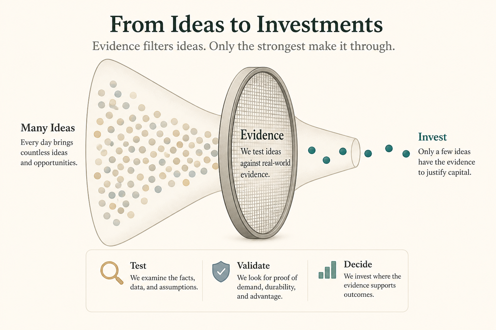

# Start with goals, not approved ideas; invest only where evidence appears

**Source:** Itamar Gilad (@itamargilad)
**Post:** https://x.com/itamargilad/status/1612758978911502343

## What it claims

Committees chasing pre-approved ideas waste effort. (1) Start with goals. (2) Many ideas per goal; most won’t matter (some hurt). (3) Cheaply assess/test many; invest only in those with supporting evidence. (4) Managers lack time/tools/expertise to do that—that’s the product team’s job. Transparency makes leaders more effective, not less.

## Why it matters for a PO

This is the evidence-guided (ICE-family) stance without the acronym: confidence comes from tests, not HiPPO. The PO should run discovery, not just groom committed ideas.

## 3 takeaways

1. Goal first, ideas second.
2. Most ideas fail; testing is the filter.
3. Discovery is the team’s job, not the steering committee’s.

## Practice this week

For the next top-down request, write the goal, list 3 alternative ideas, and run one cheap test before a story enters “committed.”
