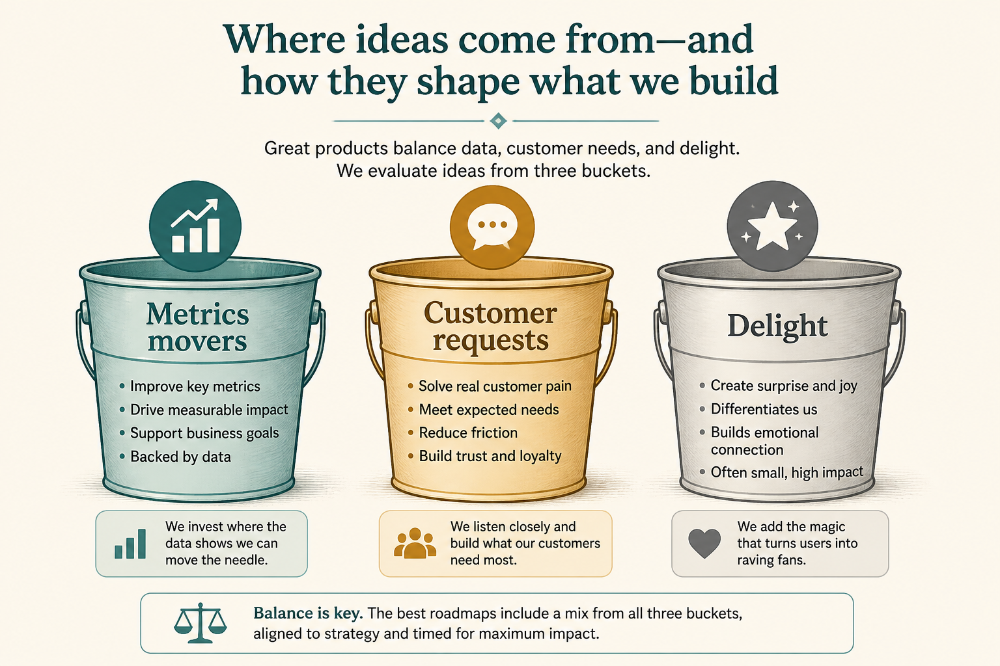

# Don’t rank all ideas on one formula: three buckets

**Source:** Adam Nash (@adamnash)
**Post:** https://x.com/adamnash/status/1164234559560380416

## What it claims

Teams trap themselves looking for one ranking formula. Put concepts into metrics movers, customer requests, and delight. (Thread is short and points to his 2009 post and a Coda/Jira template; the framework on the tweets is the three buckets.)

## Why it matters for a PO

ICE/RICE on a mixed list buries requests and delighters. A healthy sprint mix needs all three, or you get metric-chasing, ticket-chasing, or innovation-theater.

## 3 takeaways

1. One score across unlike work is a trap.
2. Explicitly bucket before ranking inside a bucket.
3. Releases that omit a bucket usually signal a process hole (feedback, strategy, or craft).

## Practice this week

Bucket the next 15 backlog items MM / CR / D. If one bucket is empty, add one candidate or explain the hole to the team.
