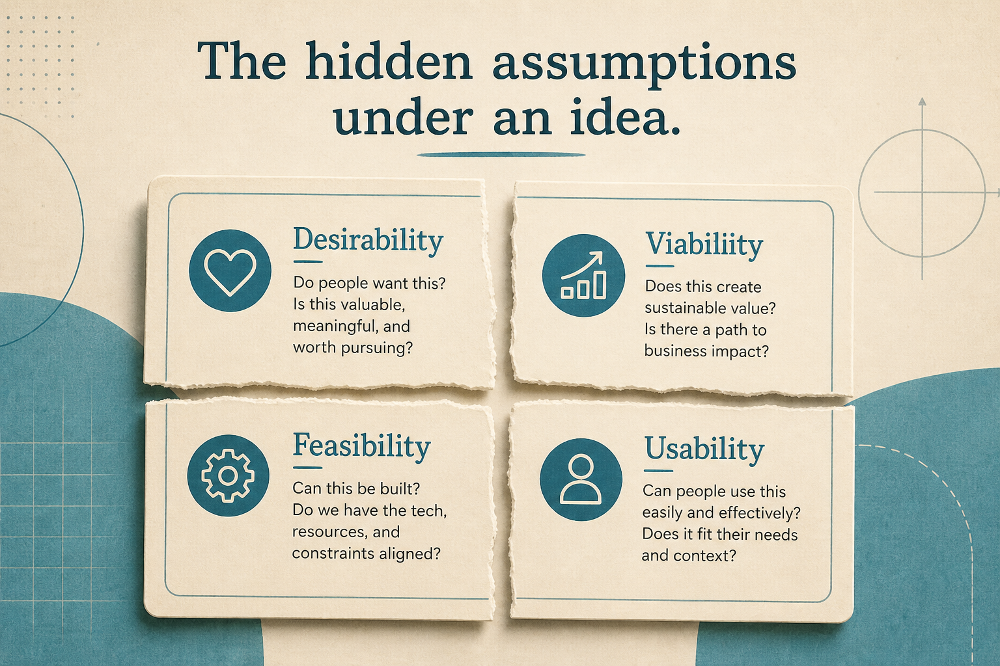

# Deconstruct every idea into hidden assumptions (even in a feature factory)

**Source:** Teresa Torres (@ttorres)
**Post:** https://x.com/ttorres/status/1744418203470876966

## What it claims

One habit every team can start today, including feature factories and teams barred from customers. It takes under an hour once learned: deconstruct ideas into underlying assumptions. Seeing the bets improves the idea even if you cannot test yet. Five methods: story maps; walking OST lines for viability; ideal-customer attributes (who you leave out); data audit; pre-mortem.

## Why it matters for a PO

Works when the delivery contract cannot change. Shared language for risk without refusing the request.

## 3 takeaways

1. Assumption work is allowed when research is not.
2. Story maps, ICPs, audits, and pre-mortems count without a full OST.
3. Seeing hidden bets has value before tests.

## Practice this week

One committed item, 60 minutes: list D/V/F/U assumptions; star two killers; share in refinement.
