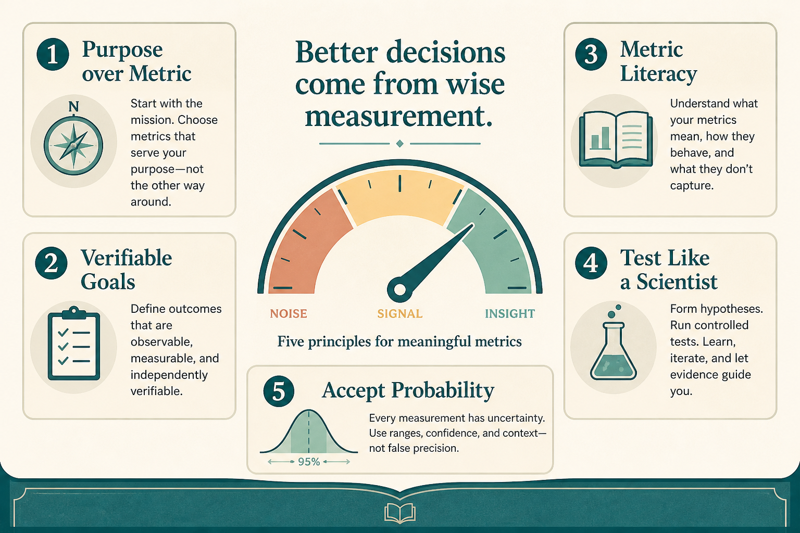

# Internalize five values, not a dashboard, to be data-informed

**Source:** Julie Zhuo (@joulee)
**Post:** https://x.com/joulee/status/1588256743938662400

## What it claims

Five values: purpose over metric-as-meaning (metrics are proxies); verifiable goals over vague aspirations; company-wide metric literacy vs outsourcing to “data people”; test beliefs like a scientist, don’t confirm intuition; accept probabilities, not certainty. Data raises the odds of the right call; those increases compound.

## Why it matters for a PO

A checklist for whether numbers are deciding vs decorating. Protects purpose when a metric move would harm users.

## 3 takeaways

1. Metrics proxy human value.
2. Vague goals hide disagreement.
3. Ask what evidence would change your mind.

## Practice this week

Rewrite the current goal as a number + date plus one sentence of purpose it proxies.
