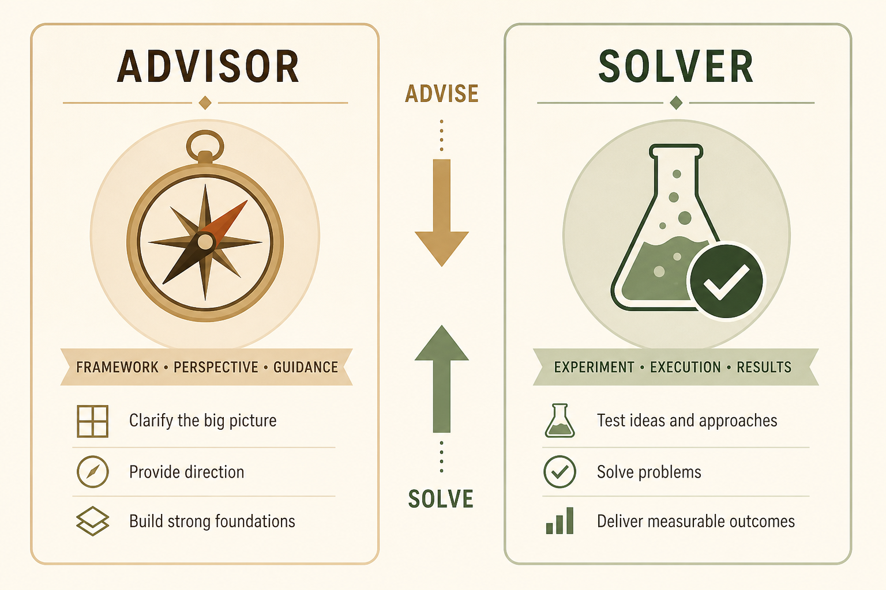

# Match advisor vs solver to the relationship, not your habit

**Source:** Julie Zhuo (@joulee)
**Post:** https://x.com/joulee/status/1524464365344223232

## What it claims

Advisor = influence with frameworks (words, stories). Solver = prove a decision (action, experiments, PoC). Managers advise reports (empower); reports solve for managers (reduce burden). Solving downward feels like distrust; advising upward without doing dumps load on the manager.

## Why it matters for a PO

A PO sits between team and stakeholders. Wrong mode reads as “not empowered” or “not driving.”

## 3 takeaways

1. Style is a role choice, not a personality.
2. Down: advise. Up: solve.
3. Talk without do increases their load.

## Practice this week

Label the next steering or 1:1 as advisor or solver; bring a principle or a PoC accordingly.
