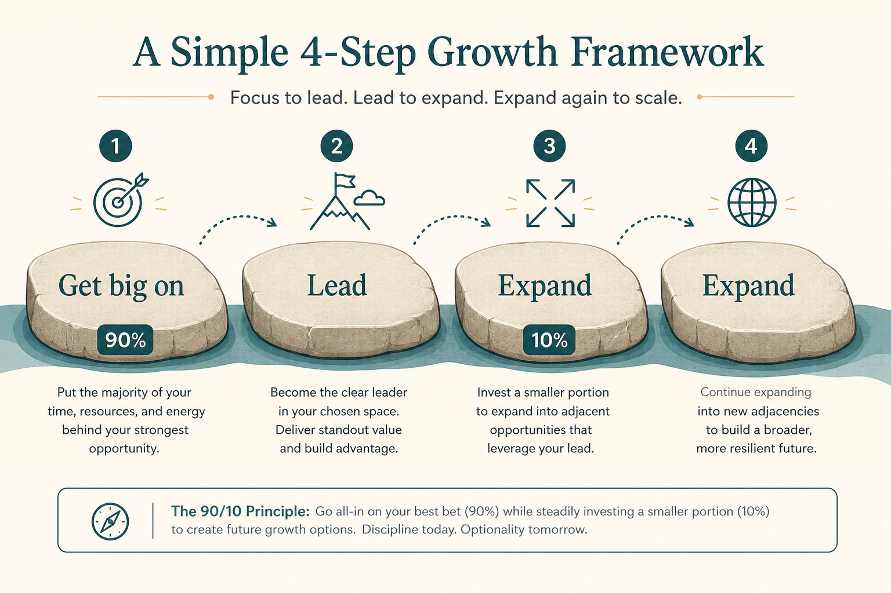

# Write a GLEE vision, then debate the investment mix

**Source:** Gibson Biddle (@gibsonbiddle)
**Post:** https://x.com/gibsonbiddle/status/1481659656644743169

## What it claims

GLEE = Get Big On / Lead / Expand / Expand. Netflix’s 20-year hypothesis ran DVD → streaming → international → interactive. Each step is a hypothesis (Red Envelope failed; originals worked). Alignment comes from debating % investment per step at a moment in time (e.g. 2007: 90% DVD / 10% streaming).

## Why it matters for a PO

Shows this quarter as a mix across beachhead / lead / expand, not lights-on vs innovation.

## 3 takeaways

1. Vision is a sequence of bets.
2. Failed steps are expected.
3. Agree the mix, not every feature.

## Practice this week

Four GLEE lines + rough capacity %; review with one other function.
