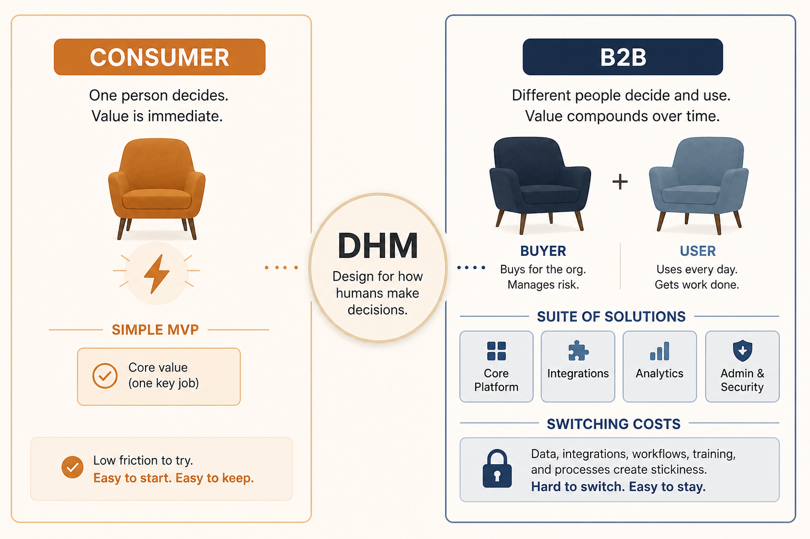

# Apply DHM on both sides; don’t copy consumer playbooks into B2B

**Source:** Gibson Biddle (@gibsonbiddle)
**Post:** https://x.com/gibsonbiddle/status/1295500698746929152

## What it claims

Consumer = lightning in a bottle, user=customer, simplicity, duct-tape MVP. B2B = paying reference customer, buyer≠user, required complexity, suites, external alignment with key accounts. DHM (Delight / Hard-to-copy / Margin-enhancing) holds in both; switching costs are much larger in enterprise.

## Why it matters for a PO

Names buyer≠user, fake-harder, and complexity-as-strategy so a B2B PO does not import consumer tactics wholesale.

## 3 takeaways

1. DHM travels; consumer tactics often don’t.
2. A paying reference is the B2B MVP.
3. Switching costs and suites are strategy.

## Practice this week

One epic: Buyer job vs User job; name one hard-to-copy advantage this quarter.
