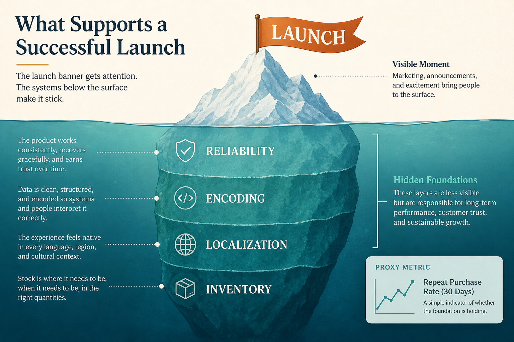

# Fund the invisible work that makes the product “just work”

**Source:** Gibson Biddle (@gibsonbiddle)
**Post:** https://x.com/gibsonbiddle/status/1453095731959578626

## What it claims

PR asks “what’s new?”; hubs, inventory-merch integration, re-encoding, progressive play, 40-language dubbing were the real product. Proxy: % first-choice DVDs next day, 60s→90s, drove retention.

## Why it matters for a PO

Invisible reliability loses to the next launch unless it has a proxy metric.

## 3 takeaways

1. “What’s new?” is PR, not strategy.
2. Invisible work needs a value-tied proxy.
3. Ops, encoding, and localization often own the product.

## Practice this week

Name one invisible capability a visible feature depends on; protect one sprint item for its proxy.
