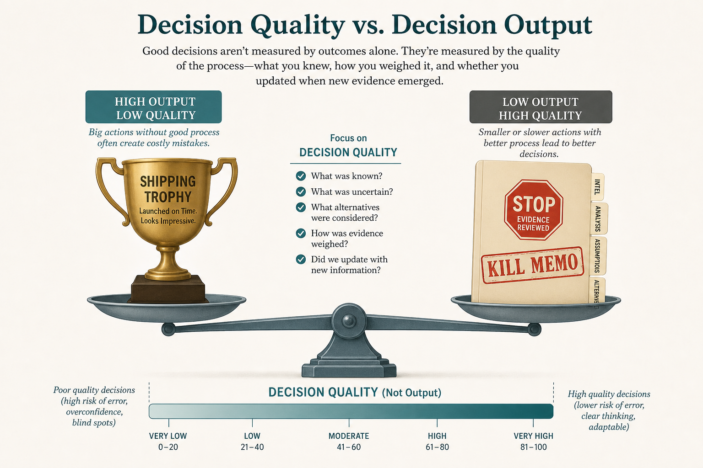

# If you only reward shipping, you punish the person who kills a bad idea

**Source:** Itamar Gilad (@itamargilad)
**Post:** https://x.com/itamargilad/status/1615688365151748096

## What it claims

PM1 launches; PM2 returns evidence to stop. Perf = Scope × Impact (via Shreyas). Wrong “scope” (headcount, committees) and “impact” (= output/execution) work against discovery. PMs asked to run ideas, not goals. You can do everything right and still fail. Judge decision process and contribution to outcomes, or optimize the org not the cog.

## Why it matters for a PO

Throughput scoring makes a stop look like low scope. Narrate evidence and cost avoided.

## 3 takeaways

1. Idea-assignments + scope × output punish discovery.
2. High-scope theater is rational under those scores.
3. Judge decision quality, not just results.

## Practice this week

Write a one-page kill memo next to the backlog item that should stop.
