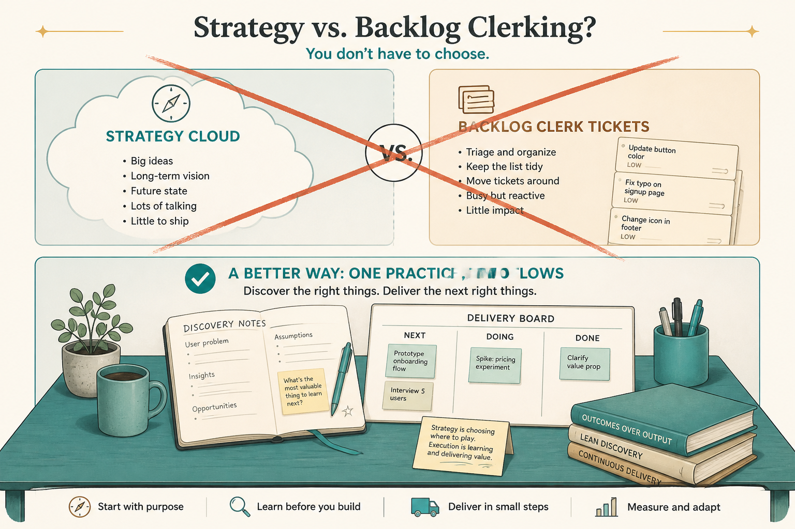

# Don’t split strategy from tactics; don’t make “PO” a full-time backlog job

**Source:** Itamar Gilad (@itamargilad)
**Post:** https://x.com/itamargilad/status/1522136715158245377

## What it claims

Scrum PO (backlog, team, stakeholders) is a subset of PM. Full-time PO hiring came from ceremony load plus a strategic-PM / tactical-PO split that has never really worked. Solution: delegate and cut process so the same person can discover and deliver.

## Why it matters for a PO

If the week is tickets and standups, you are in the split that fails. PO is a Scrum accountability, not the whole job.

## 3 takeaways

1. Backlog + ceremonies ≠ the job.
2. A strategy/tactics split makes a clerk.
3. Cut process; discover and deliver.

## Practice this week

Delegate story drafting for one sprint; use the hours for problem framing.
