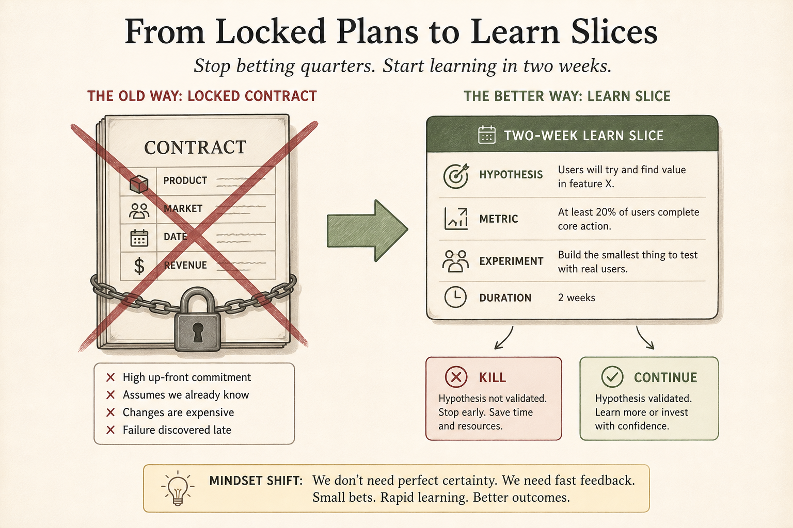

# Refuse the contract of false predictability

**Source:** Itamar Gilad (@itamargilad)
**Post:** https://x.com/itamargilad/status/1605498335229382656

## What it claims

New/untested work is forced to product, market, date, and revenue. The team is kept busy; sales may already sell it. Direction unknown → slow, long, short of numbers, then blame or rescue projects. The facade of predictability is an unfair contract; silent commitment is soul-crushing.

## Why it matters for a PO

The PO usually signs the date. Name the contract before negotiating ranges or a discovery slice.

## 3 takeaways

1. Busy + pre-sold ≠ validated.
2. Predictability theater produces rescue work.
3. Replace silent commitment with a smaller explicit contract.

## Practice this week

Write the unknowns; propose a two-week learn slice with kill/continue instead of a launch date.
