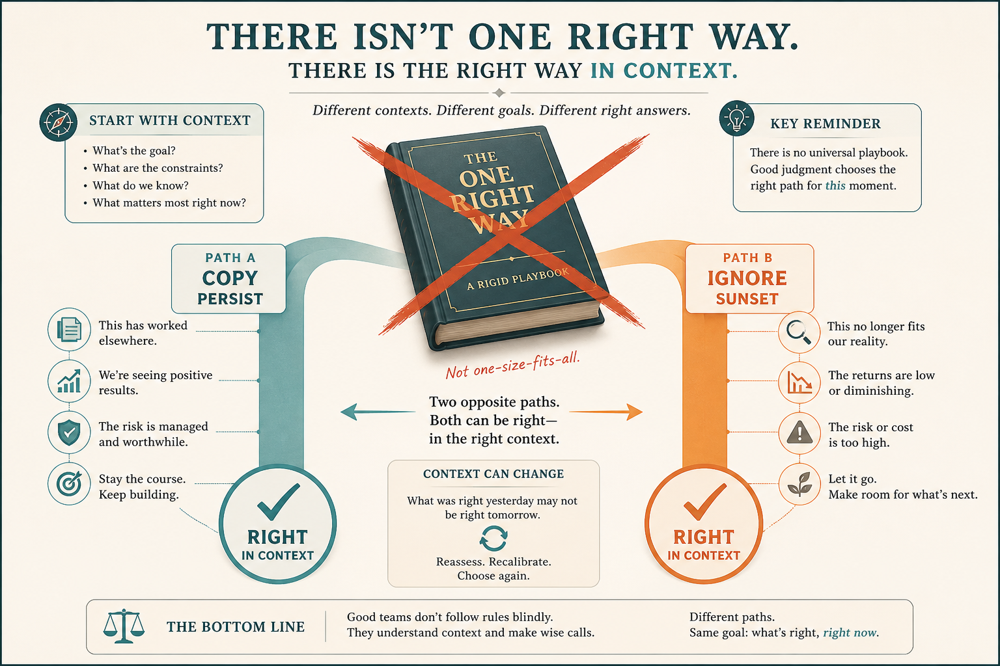

# Discard “the one right way”; context beats dogma

**Source:** Shreyas Doshi (@shreyas)
**Post:** https://x.com/shreyas/status/1360784465560182788

## What it claims

The right move is conditional (copy vs ignore competitors; what users say vs not; consensus vs disagree-and-commit; persist/pivot/sunset). A good PM is right more often than most smart teams. Methods that worked become dogma; context matters more. Use frameworks; don’t let them use you. Consistency is a proxy, not the goal.

## Why it matters for a PO

Permission to re-diagnose context before copying last quarter’s playbook.

## 3 takeaways

1. Opposite tactics can both be right.
2. A winning method becomes dogma when context changes.
3. If the framework decides, drop it.

## Practice this week

List three “we always…” rules; write when the opposite is better; change one next sprint.
