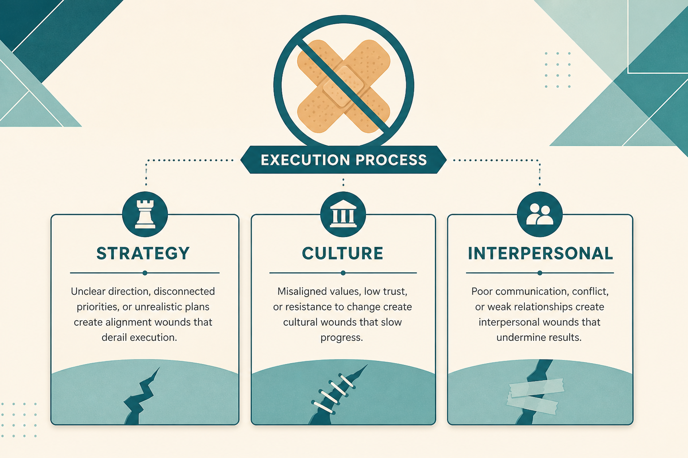

# Treat execution failures as strategy, culture, or interpersonal wounds

**Source:** Shreyas Doshi (@shreyas)
**Post:** https://x.com/shreyas/status/1427116990162817032

## What it claims

Most “execution” problems are strategy, interpersonal, or culture; good leaders fix the wound, bad ones apply band-aids. Default thinking level (Impact / Execution / Optics) becomes habit: Owners, Doers, Politicians. Impact = (Execution ^ Strategy) × Market. Problem solving is problem trading. UPOD is good externally, bad for personal goals. Opportunity cost > ROI.

## Why it matters for a PO

Diagnose delivery slips upstream. Stop filling sprints with positive-ROI tickets that hide the real wound.

## 3 takeaways

1. Diagnose before adding process.
2. Default to Impact, not Execution or Optics.
3. Score work by opportunity cost, not ROI theater.

## Practice this week

One-pager on last retro’s “execution” complaint: strategy, culture, or interpersonal wound? Name the problem you choose to live with.
