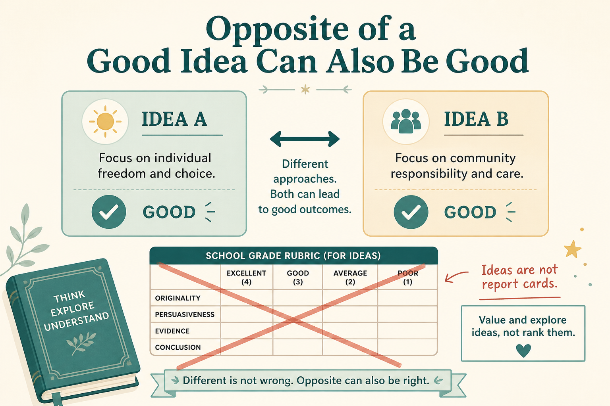

# Unlearn school: the opposite of a good idea can also be good

**Source:** Shreyas Doshi (@shreyas)
**Post:** https://x.com/shreyas/status/1338757977000398848

## What it claims

If X is a good idea, the opposite can also be (h/t Sutherland). Usually there is no rubric. Highest-ROI work compounds for years without a grade. Break supposed rules; don’t break laws. Simple ≠ easy.

## Why it matters for a PO

Playbooks aren’t answer keys. Judgment under no rubric is the PO job.

## 3 takeaways

1. The opposite of a good idea can work.
2. Waiting for a rubric is school.
3. Simple isn’t easy.

## Practice this week

Write the opposite of one “best practice” and a product where it worked; ask which context you’re in.
