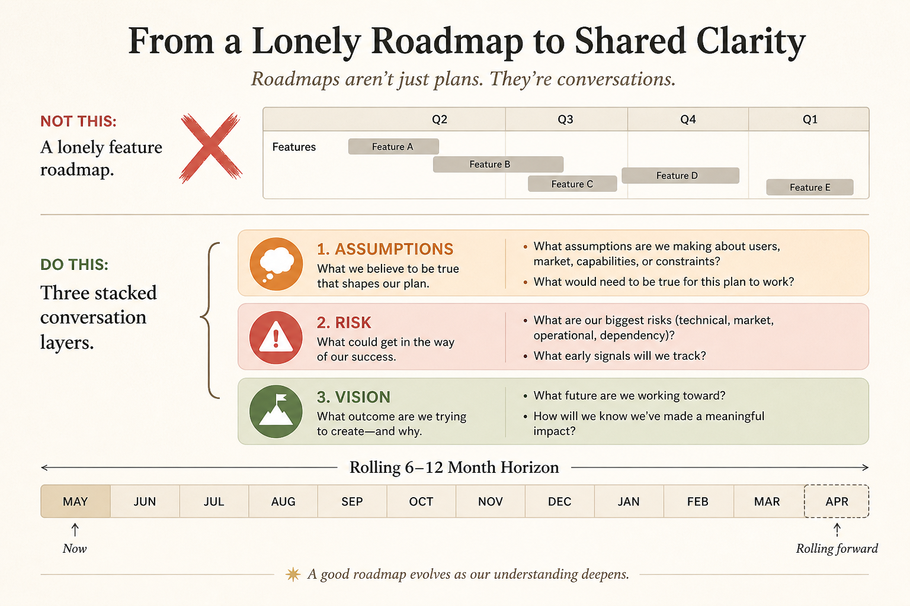

# Roadmaps never stand alone; feature lists force premature convergence

**Source:** John Cutler (@johncutlefish)
**Post:** https://x.com/johncutlefish/status/1069668045658894336

## What it claims

No artifact carries assumptions, risk, vision, and the bet. “Solid roadmap everyone understands” is a race to the bottom. Feature roadmaps cause premature convergence; converge at the last responsible moment. Rolling 6–12 month roadmap, one-liners OK 2+ months out; multiple audience versions; no magic format.

## Why it matters for a PO

Own the conversation, not the perfect slide.

## 3 takeaways

1. Standalone roadmaps race to the bottom.
2. Converge late, at the last responsible moment.
3. Keep a rolling 6–12 month view.

## Practice this week

Same rolling view as outcomes and as 8-week features; ask which questions each answers.
