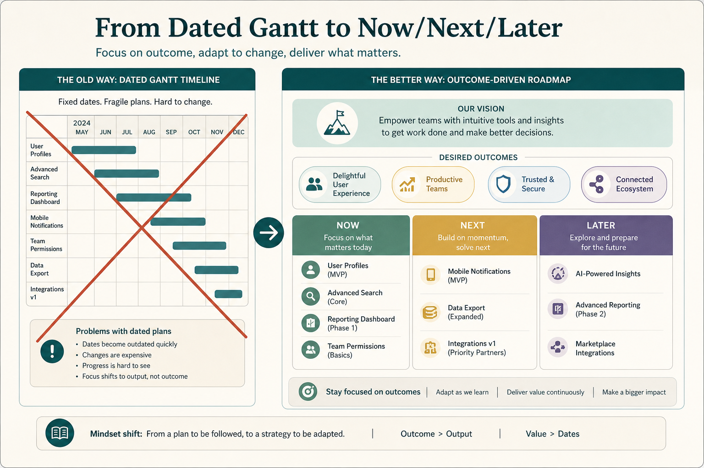

# A timeline roadmap is a pile of assumptions; prototype strategy instead

**Source:** Janna Bastow (@simplybastow)
**Post:** https://x.com/simplybastow/status/1168531672335343616

## What it claims

A timeline puts dates and durations on every item: duration known, no disruption, first-time success, every feature deserves to exist. Replace with vision (Moore elevator pitch), outcomes/OKRs, and time horizons. The roadmap is a prototype of strategy; the value is in roadmapping as discovery.

## Why it matters for a PO

You can say “this is a strategy prototype, not a delivery contract.”

## 3 takeaways

1. Far-out dates encode undefendable assumptions.
2. Use vision + outcomes + horizons.
3. The artifact should change as you learn.

## Practice this week

Strip far dates; Now/Next/Later; put one company objective over each Now item.
