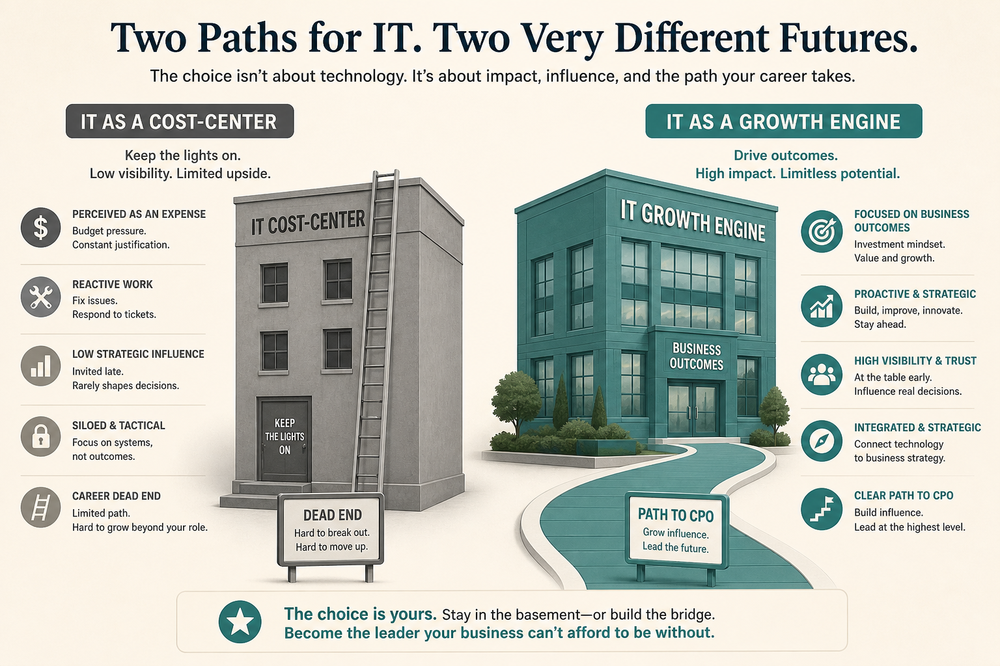

# Enterprise PM stalls as IT cost-center with no path to CPO

**Source:** Melissa Perri (@lissijean)
**Post:** https://x.com/lissijean/status/1179536159854268416

## What it claims

Enterprises treat PM as a team-level IT cost center, not a business function. Growth companies treat it as a growth engine. They train everyone then cut budget; never hire mid/top product leaders; stay stuck at team process. PM is a role/career to CPO, not like agile or design thinking.

## Why it matters for a PO

Name cost-center vs growth-engine. Argue for outcomes and coaching without pretending you’re a startup.

## 3 takeaways

1. No CPO path = cost-center design.
2. Training everyone ≠ hiring leaders.
3. Product is a career, not a workshop.

## Practice this week

Map who funds and promotes you; three sentences cost-center vs growth-engine for one stakeholder talk.
