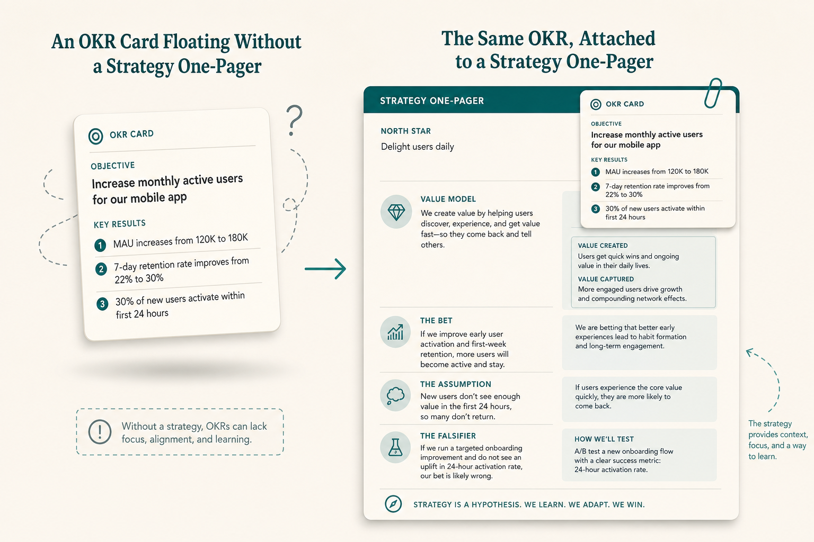

# OKRs are easy only when strategy exists; they fail as “the thing”

**Source:** John Cutler (@johncutlefish)
**Post:** https://x.com/johncutlefish/status/1072722878162919424

## What it claims

With a value-creation model, uncertainty handling, strategy, and shared context, OKRs are an afterthought. Overloaded as strategy + performance management they damage teams. Many prod-dev efforts aren’t “bricks across a parking lot.” Context-less; usually no one-pager.

## Why it matters for a PO

Attach the bet and assumptions, or admit the KR is theater.

## 3 takeaways

1. OKRs are an afterthought of strategy, not a substitute.
2. Don’t overload them as strategy plus performance management.
3. Attach a one-pager of context.

## Practice this week

Five-line one-pager per KR (model, bet, assumption, falsifier, what we stop).
