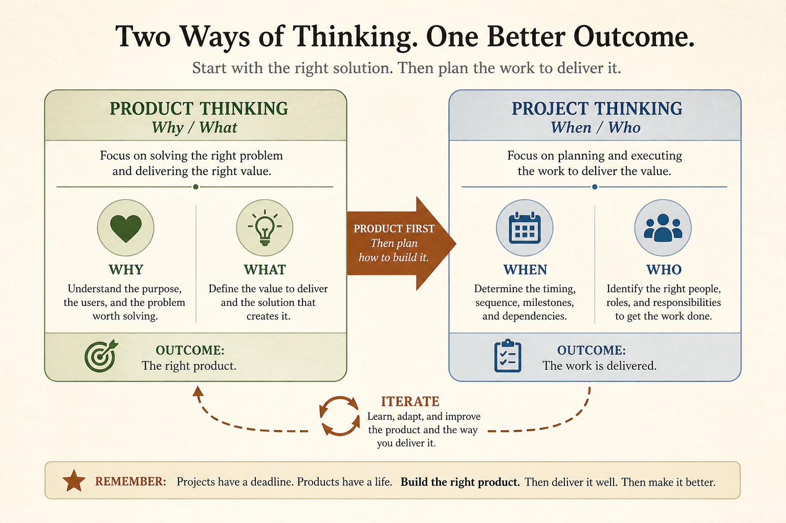

# Product Thinking before Project Thinking, then iterate both

**Source:** Shreyas Doshi (@shreyas)
**Post:** https://x.com/shreyas/status/1471650411341750273

## What it claims

Growing teams bias to Project (When/Who: expectations, plans, resources) over Product (Why/What: motivations, options, simulated effects). Product first, then Project feasibility, then iterate. Neither is “better.” Primer: suspend project mode, real goals, user needs, options, simulate.

## Why it matters for a PO

Mode mismatch is fake alignment. Start with Why/What so escalations become choices.

## 3 takeaways

1. When/Who is Project; Why/What is Product.
2. Product first, then Project.
3. Teach both modes; don’t pick a religion.

## Practice this week

Rewrite one intake as Why/What/effects before When/Who; two options plus the traded problem.
