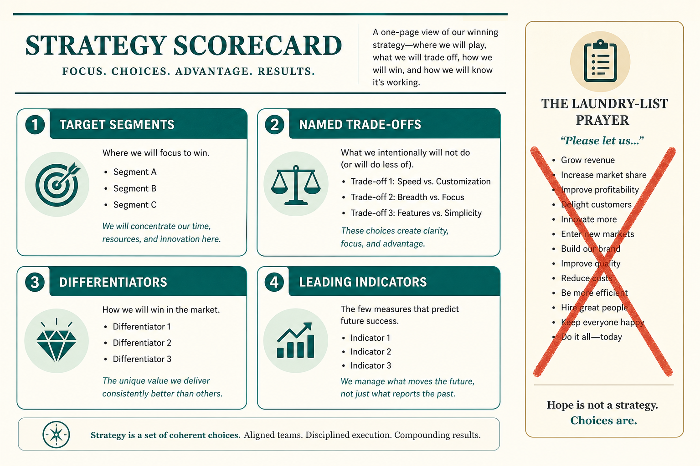

# Good product strategy names segments, trade-offs, and leading indicators

**Source:** Shreyas Doshi (@shreyas)
**Post:** https://x.com/shreyas/status/1244810075908128768

## What it claims

Good vs bad strategy (Porter/Magretta, 7 Powers, Rumelt): target and non-target segments; honest market/competition; subset of needs; head-to-head vs different turf; named trade-offs; lasting advantages; concrete differentiators not “world-class”; leading+lagging indicators; company upside; mapped to action/risks; fresh exec perspective not consensus prayer; memorable; long-term results not near-term consensus.

## Why it matters for a PO

Laundry-list “strategy” is a prayer. This checklist is a reason to slow the roadmap.

## 3 takeaways

1. No trade-offs or segments = bad strategy.
2. Require differentiators and leading indicators.
3. Prefer long-term results over near-term consensus.

## Practice this week

Score the current strategy on five of these items; share the scorecard, not a rewrite.
