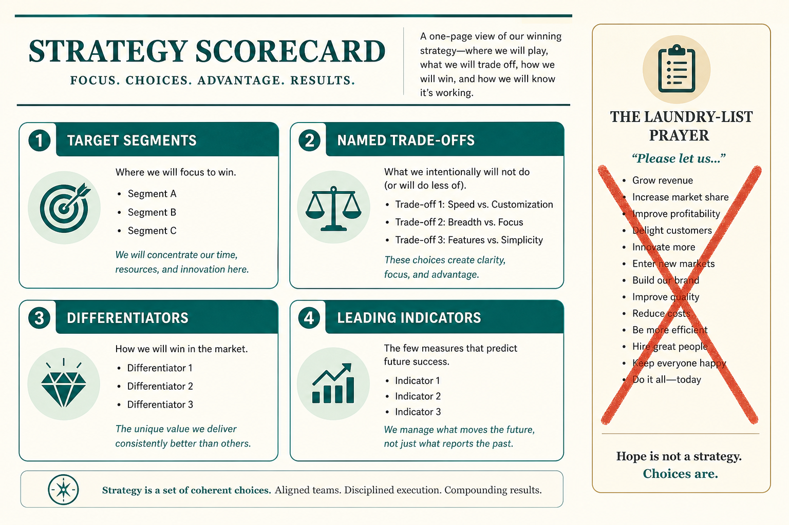

---
filters:
  topic:
    - strategy
    - metrics-analytics
  format: framework
  source: shreyas-doshi
---

# Good product strategy names segments, trade-offs, and leading indicators

**Source:** Shreyas Doshi (@shreyas)
**Post:** https://x.com/shreyas/status/1244810075908128768

## What it claims

Good vs bad strategy (Porter/Magretta, 7 Powers, Rumelt): target and non-target segments; honest market/competition; subset of needs; head-to-head vs different turf; named trade-offs; lasting advantages; concrete differentiators not “world-class”; leading+lagging indicators; company upside; mapped to action/risks; fresh exec perspective not consensus prayer; memorable; long-term results not near-term consensus.

## Why it matters for a PO

Laundry-list “strategy” is a prayer. This checklist is a reason to slow the roadmap.

## 3 takeaways

1. No trade-offs or segments = bad strategy.
2. Require differentiators and leading indicators.
3. Prefer long-term results over near-term consensus.

## Practice this week

Score the current strategy on five of these items; share the scorecard, not a rewrite.

## Also from

- **Shreyas Doshi (@shreyas)**, [original post](https://x.com/shreyas/status/1384008853004578822) (merged from lesson 67): For B2B, the short form is target segments, differentiation, and how you reach them. Extra tests: a Porter generic strategy, capabilities you can visualize, Helmer’s Powers (now and new), credible execution, a non-obvious insight rather than “be the best,” and uniqueness (Roger Martin). Run Amazon’s five questions at the feature level. Roadmaps, OKRs, visions, and plans are not strategy, even with “Strategic” in the title.
