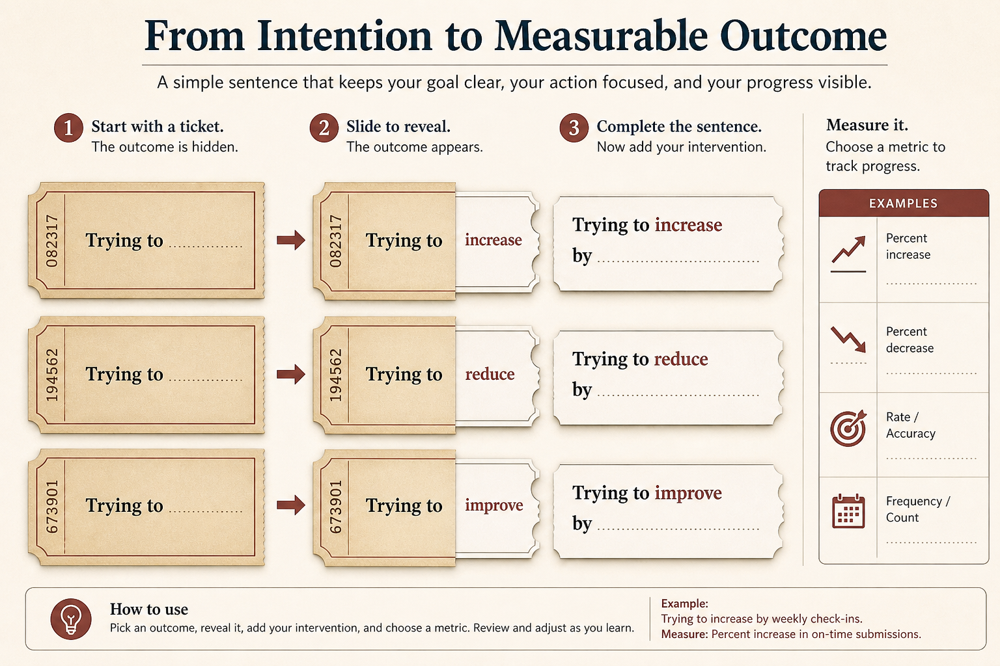

# Smuggle outcome language in; don’t wait for permission

**Source:** John Cutler (@johncutlefish)
**Post:** https://x.com/johncutlefish/status/1062500271543078912

## What it claims

Use missions/bets/outcomes alongside features (Trojan horse). Monthly outcome reviews including failures. Sentence: “Trying to [outcome] by [intervention].” One proof outcome bet. Belief/bet map. Measurement column. Stay problem-focused (“candidate ideas”). Basics (quality, flow, flags) first or nobody can be outcome-focused.

## Why it matters for a PO

Change language in place. Reliability is a prerequisite for outcome work.

## 3 takeaways

1. Add outcome language beside features.
2. Outcome first; features are the intervention.
3. One bet beats a manifesto.

## Practice this week

Rewrite touched items as Trying to [outcome] by [intervention]; add Measurement; 30-min review including a miss.
