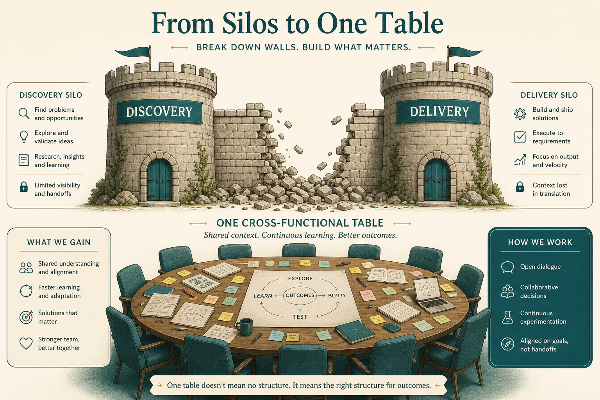

# Don’t let “discovery” and “delivery” become kingdoms

**Source:** John Cutler (@johncutlefish)
**Post:** https://x.com/johncutlefish/status/990303900430303232

## What it claims

Discovery/design/delivery words get coopted into silos and pretty SDLC diagrams. Team members going upstream ≠ Jira/PMO handoffs. PM/design owning “the problem” to feed delivery is a self-fulfilling trap. Messy cross-functional explore/exploit beats toxic silos. Give developers a shot at discovery.

## Why it matters for a PO

Dual-track as a discovery queue is the kingdom. Invite engineers before stories exist.

## 3 takeaways

1. Team activity ≠ a Jira silo.
2. Owning “the problem” traps you.
3. Developers discover too.

## Practice this week

Engineer in the next customer/assumption session before stories; no new Discovery column.
