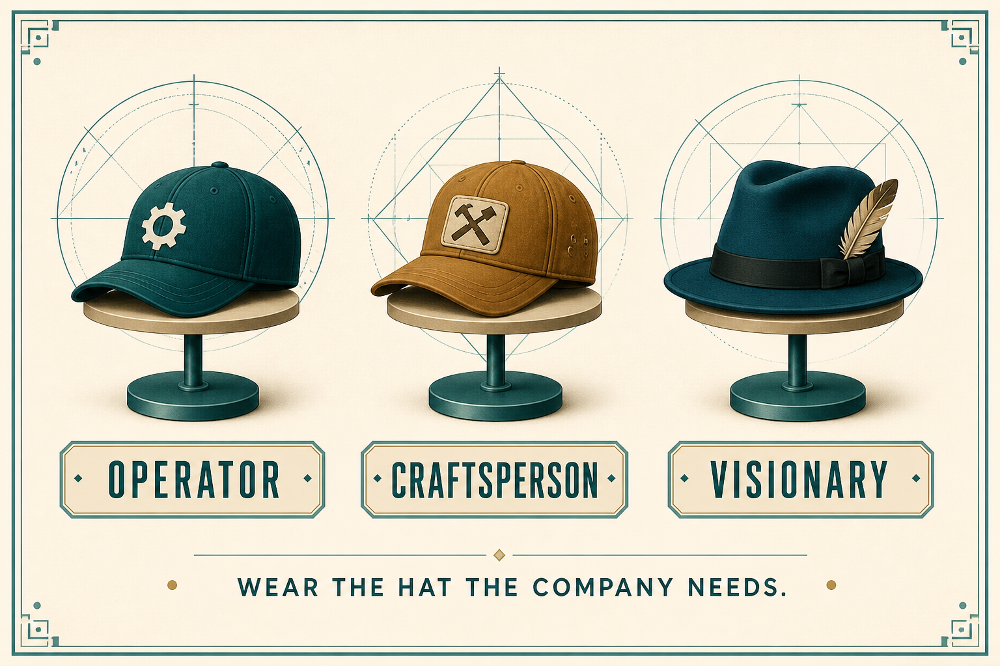

# Wear the Operator / Craftsperson / Visionary hat the company actually needs

**Source:** Shreyas Doshi (@shreyas)
**Post:** https://x.com/shreyas/status/1375491623308550144

## What it claims

Three product-leader hats: Operator (scale, alignment, unblocking; communication superpower), Craftsperson (product insight, strategy, mentoring), Visionary (what’s next; not excellent at people/scale). Most people have a preferred hat they can switch. Founders often hire an Operator when they need a Craftsperson, then keep a Craftsperson when the org is scaling and needs an Operator. Hire to complement. You can predict the hat from interview questions.

## Why it matters for a PO

A PO’s job changes as the product and org change. Naming your preferred hat (and your manager’s) stops you from treating a type mismatch as personal failure.

## 3 takeaways

1. Treat Operator / Craftsperson / Visionary as preferred hats, not personality prisons.
2. Watch for type mismatch as you scale: early Craftsperson, later Operator is a common sequence.
3. Hire to complement; predict the hat from what the person asks about.

## Practice this week

Write your preferred hat and the hat the next quarter actually needs. Name one complement to hire, pair with, or borrow.
