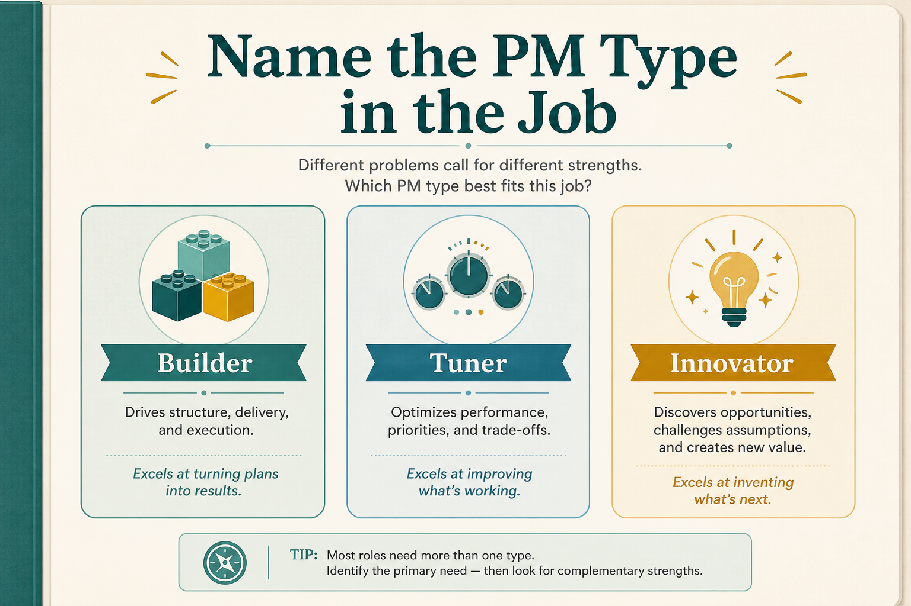

# Name the PM type in the job: Builder, Tuner, or Innovator

**Source:** Shreyas Doshi (@shreyas)
**Post:** https://x.com/shreyas/status/1328372392566030336

## What it claims

Sachin Rekhi’s three PM types — Builders, Tuners, Innovators — map to execution, analytical, and product sense. Ask the hiring manager the primary type; if they cannot name one, that is a yellow flag. Use the vocabulary in postings instead of 15-bullet JDs. Type mismatch severely limits impact. Early in a career, seek all three; later, mismatch only with intent and support.

## Why it matters for a PO

PO roles are often posted as generic “own the backlog.” Naming Builder / Tuner / Innovator makes the actual work visible and explains why a strong PO from one context underperforms in another.

## 3 takeaways

1. Ask (and state) the primary type for the role before hiring or joining.
2. Type mismatch, not lack of intelligence, is what usually caps impact.
3. Seek all three types early; later, mismatch only with intent and support.

## Practice this week

Label your current work Builder, Tuner, or Innovator. In the next hiring or pairing conversation, say the type out loud instead of a 15-bullet JD.
