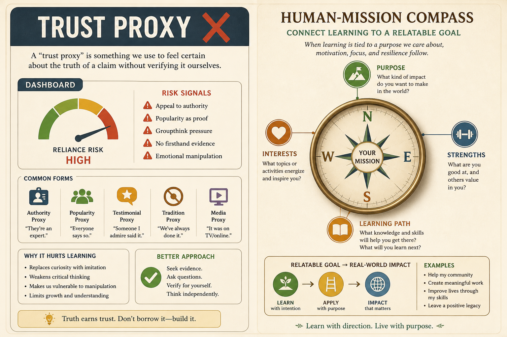

# Data is not a trust proxy; connect learning to a human-relatable mission

**Source:** John Cutler (@johncutlefish)
**Post:** https://x.com/johncutlefish/status/1214639241914793985

## What it claims

Teams treat data as a trust proxy, when you need more trust to face disconfirming insights. Enterprise B2B still makes decisions with data. The real shift is connecting all learning to a human-relatable mission. Dashboard-ification loses the exploration that formed the question. Super-long warehouses forget the Why. People want pride, impact, and intellectual honesty.

## Why it matters for a PO

POs are asked to “be more data driven” and either over-index on dashboards or abandon quant. Build trust so the team can look at disconfirming evidence, and tie every metric back to a mission a human would recognize.

## 3 takeaways

1. Data does not replace trust; trust is required to use disconfirming data.
2. Connect every measure to a human-relatable mission, not a funnel dashboard.
3. Start with questions and decisions, and keep iterating the question.

## Practice this week

Pick one dashboard the team treats as truth. Write the human-relatable mission it is supposed to serve, and one disconfirming insight you would need psychological safety to discuss.
