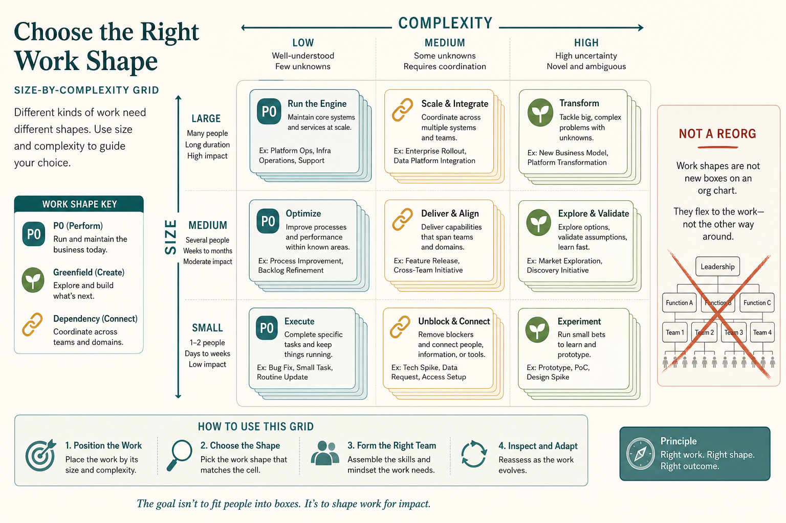

# Don’t start with role/process fixes; map 15+ shapes of work first

**Source:** John Cutler (@johncutlefish)
**Post:** https://x.com/johncutlefish/status/1166948663668559872

## What it claims

When people shout “our process is broken” or “fix product vs design,” do a six-step exercise instead of a reorg. Blurt last six months of work onto Size × Complexity. Group similar work. Most teams end up with 15+ shapes (greenfield vs P0). Capture how you approach each now, then experiment with working agreements. Output is a shared language, not a new org chart.

## Why it matters for a PO

POs get pulled into RACI debates that do not change the work. Mapping shapes first makes it obvious a P0 and a greenfield bet cannot share one process.

## 3 takeaways

1. Process and role fights are usually unmapped work in disguise.
2. Expect 15+ shapes; one workflow will not cover them.
3. Capture current collaboration per shape, then experiment.

## Practice this week

In a 45-minute team session, blurt last six months of work onto a Size × Complexity grid, cluster into shapes, and write one current-state working agreement for the two most common shapes.
