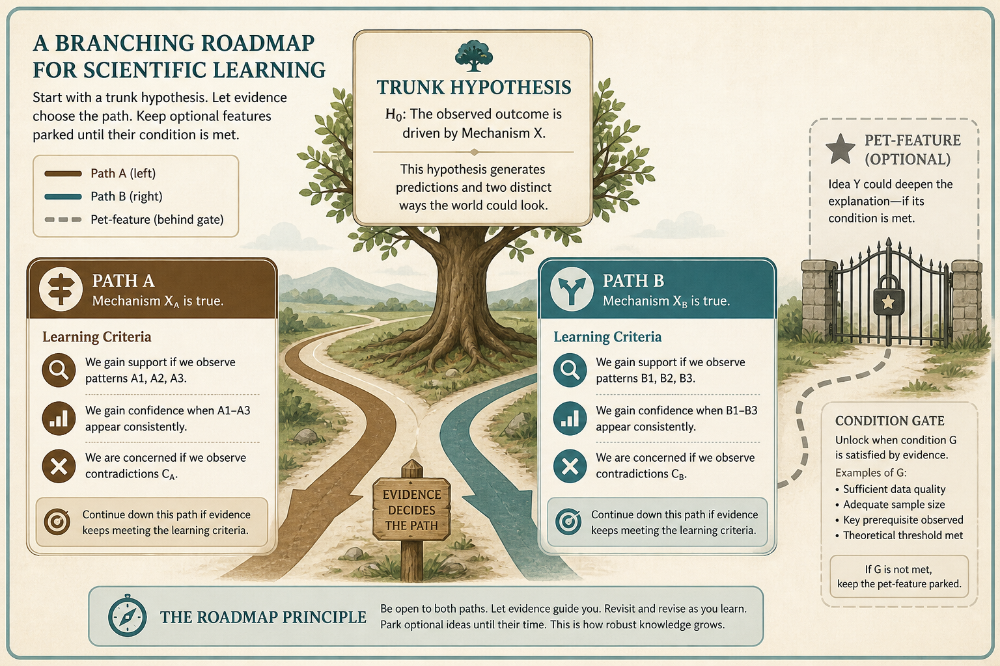

# Honest roadmaps branch; park pet features behind learning criteria

**Source:** Pavel A. Samsonov (@PavelASamsonov)
**Post:** https://x.com/PavelASamsonov/status/1296818042928861184

## What it claims

Linear roadmaps are misleading without a crystal ball. Anticipate branches and create criteria for each path: “this is what we need to learn by this milestone.” Pair success criteria with a plan for when it has not. Steps are not timeboxed; dots are likely decision points. Put executive pet ideas on conditional branches, not on the trunk.

## Why it matters for a PO

POs must say no to a linear feature list without looking uncooperative. Branching with learning criteria keeps the pet feature visible, gated by evidence.

## 3 takeaways

1. Honesty about uncertainty is necessary but not sufficient — plan the learning that reduces it.
2. Pair success criteria with a plan for failure, checked before the last minute.
3. Put pet features on conditional branches, not on the trunk.

## Practice this week

Redraw one committed theme as a branch: hypothesis, learning by milestone, success metric, and the “if not” path. Place any executive pet idea on a labeled condition, not on Now.
