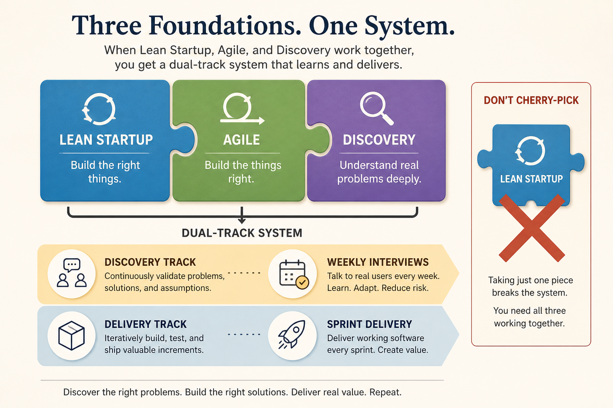

# Lean Startup, Agile, and Discovery fail when cherry-picked; combine as dual-track

**Source:** Paweł Huryn (@HurynPawel)
**Post:** https://x.com/HurynPawel/status/1589177166373478400

## What it claims

Lean Startup, Agile, and Product Discovery each fail if you cherry-pick: MVP-then-waterfall, Scrum without a validated business model, or a validated backlog that never ships. Better: start with customers and underserved needs, then run discovery (weekly interviews; Torres) in parallel with Scrum. Cites Jeff Patton Dual Track Development and Marty Cagan Dual-Track Agile. They work when combined.

## Why it matters for a PO

POs often inherit one of the three (a Scrum board, a pile of interviews, or an MVP that “proved” the idea) and wonder why outcomes stall.

## 3 takeaways

1. Cherry-picking Lean Startup, Agile, or Discovery produces waterfall, gambling, or a validated backlog that never ships.
2. Start by validating customers and the business model, then run discovery and delivery in parallel.
3. Interview weekly; keep delivery risk inside a Sprint.

## Practice this week

For one upcoming item, write the business-model assumption still untested, one discovery interview scheduled this week, and the smallest delivery slice that could falsify the assumption inside a Sprint.
