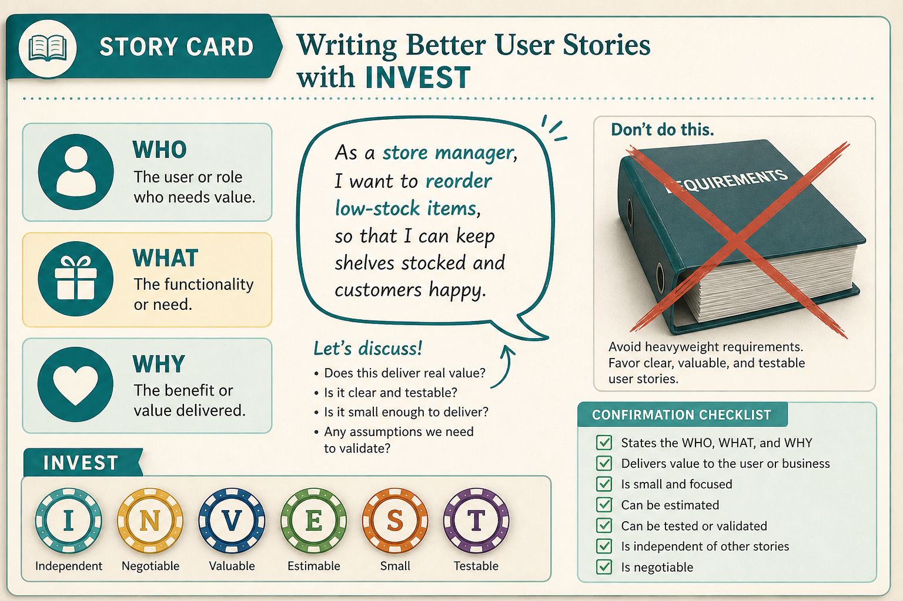

# User stories are Card, Conversation, Confirmation + INVEST — not requirement containers

**Source:** Paweł Huryn (@PawelHuryn)
**Post:** https://x.com/PawelHuryn/status/1798767949211422990

## What it claims

User stories foster collaboration; many people use them as requirement containers. Format: WHO / WHAT / WHY. The 3 Cs: Card, Conversation (not a detailed spec), Confirmation (concise acceptance checklist). INVEST: Independent, Negotiable, Valuable, Estimable, Small, Testable — a quality check, not a religion. Split: Epic (5–15 stories), Stories, Tasks (engineers own tasks; PMs have nothing to say here).

## Why it matters for a PO

The PO is usually the person filling Jira with “as a user” specs. Restore the original job: a card that starts a conversation, split small enough to learn from real use.

## 3 takeaways

1. A story is Card + Conversation + Confirmation, not a requirements document.
2. INVEST is a quality check; Small enough to finish in an iteration matters most for learning.
3. PMs do not own engineering tasks; stop adding layers above Epic / Story.

## Practice this week

Take one story that reads like a spec. Rewrite the Card (WHO/WHAT/WHY), schedule the Conversation with design + engineering, and replace the spec with a five-line Confirmation checklist.
