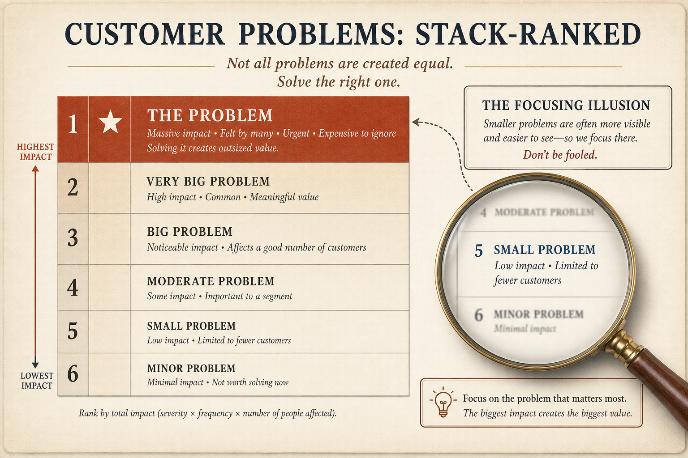

# Customers will endorse a problem; stack-rank to find the problem (CPSR)

**Source:** Shreyas Doshi (@shreyas)
**Post:** https://x.com/shreyas/status/1376033582305615873

## What it claims

A B2B cycle: customers say yes, the product ships, adoption is anemic, more features, then GTM is blamed, then sunset. The product solved a problem, not the problem. Kahneman’s Focusing Illusion: talking about a problem makes it feel more important. Fix: Customer Problems Stack Rank (CPSR) across personas. Related test: does it keep the buyer from getting fired, help promotion, or earn revenue?

## Why it matters for a PO

Discovery interviews that confirm “yes, that is a problem” are necessary and still insufficient. Without stack-rank you expand the MVP for a real problem that is not important enough to change buying.

## 3 takeaways

1. “Customers said yes” often means you hit the Focusing Illusion, not product-market fit.
2. Run CPSR with multiple personas; solve the problem, not a problem.
3. In B2B, check fire/promotion/revenue impact for the buyer, not just user pain.

## Practice this week

In your next three customer conversations, stop after they validate the problem and ask them to stack-rank it against the other problems on their plate. Capture at least one other persona’s rank.
