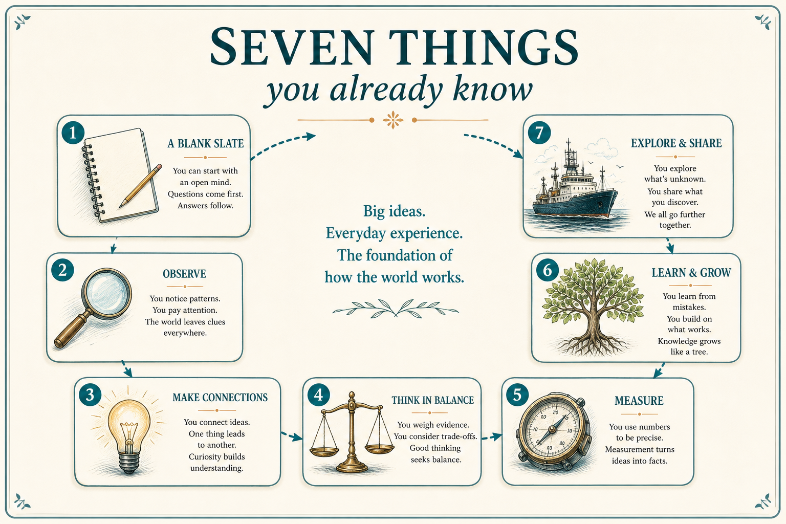

# You already know how to discover, test, and ship — stop forgetting it

**Source:** Shreyas Doshi (@shreyas)
**Post:** https://x.com/shreyas/status/1352860350719303681

## What it claims

Seven things you already know: (1) time upstream saves time downstream; (2) blank-slate talks beat idea-in-hand interviews; (3) no success/failure/decision tree → validation, not experiment; (4) shipping without usage data is shipping functionality, not a product; (5) customer face-time is motivating because it is embarrassing; (6) makers must use the product; (7) sometimes the product still fails — what you learn defines you.

## Why it matters for a PO

Operating checks a PO can run without a new process. They prevent the quiet slide from experiment to validation theater.

## 3 takeaways

1. Learn many things upfront; do not walk into customer talks with the solution already chosen.
2. No pre-committed success/failure/decision tree → you are validating, not experimenting.
3. Shipped means instrumented and used by the makers, not merely deployed.

## Practice this week

For the next experiment, write objectives, success/failure criteria, and the decision tree before kickoff. Add “how we will see usage” to the definition of done.
