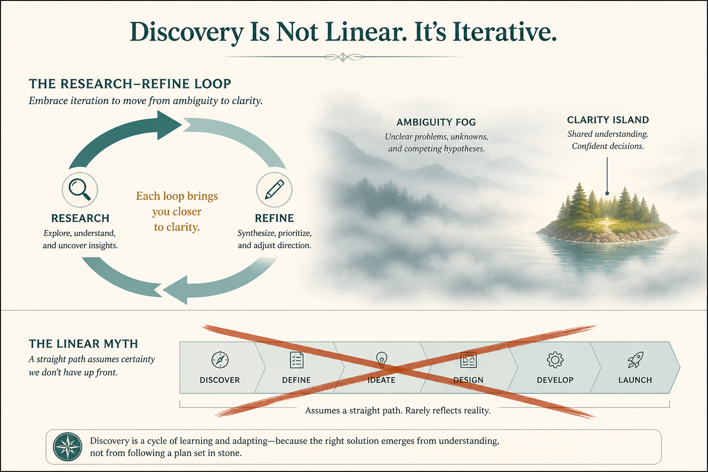

# Discovery is a Research–Refine loop; progress theater slows it down

**Source:** Shreyas Doshi (@shreyas)
**Post:** https://x.com/shreyas/status/1367165307534548992

## What it claims

Three tips: (1) swim in ambiguity before you reach product clarity — killing ambiguity early lets biases lock the problem. (2) Optimizing for showing daily progress during discovery slows actual progress, because you fake structure and certainty. (3) Discovery is not a straight line; it is a Research–Refine loop: research, rough hypotheses, research hypotheses, refine, clarify use cases…

## Why it matters for a PO

Stakeholders will ask for a discovery Gantt. Performing daily “progress” trades real learning for a status story. The loop is the honest plan.

## 3 takeaways

1. Stay in ambiguity long enough that early biases do not lock the problem.
2. Do not fake certainty to show daily progress; that slows discovery.
3. Plan discovery as Research–Refine loops, not a straight-line process.

## Practice this week

Replace the discovery status slide with a loop board: last research, current hypothesis, next research. Explicitly drop one “progress” artifact that was faking certainty.
