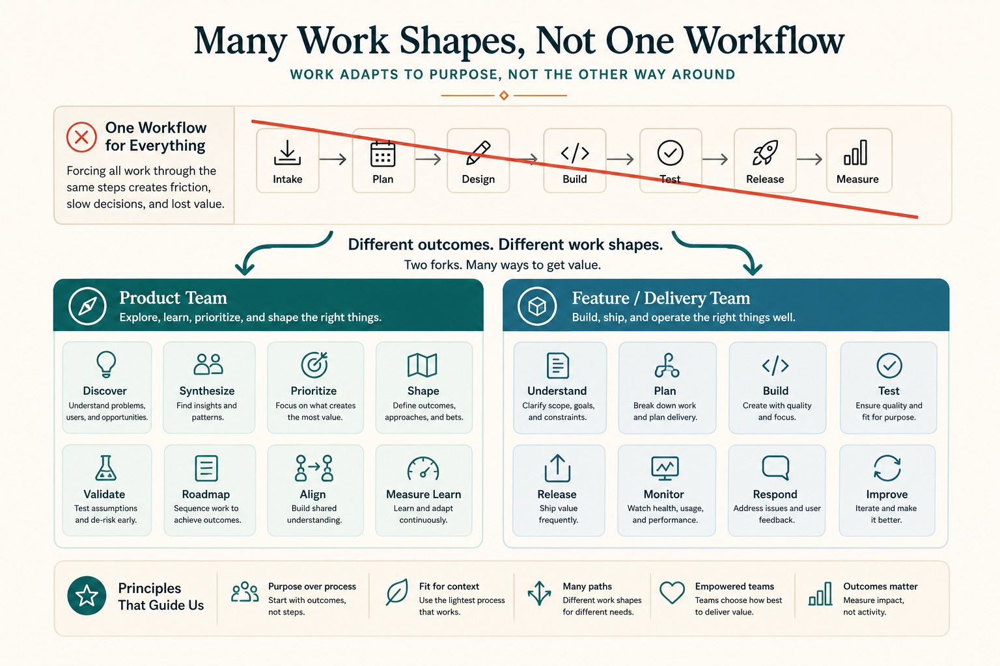

# One process cannot cover 15+ shapes of work

**Source:** John Cutler (@johncutlefish)
**Post:** https://x.com/johncutlefish/status/1176199019602698240

## What it claims

Teams typically have 15+ shapes of work, so one workflow cannot cover them. Citing Cagan: are you a product team or a delivery/feature team? If eng is “delivery,” design is “ready for eng,” and product is “design this,” you are already designing handoffs. Sprints are enabling constraints, not Tetris packing. Understaffed design often drives the process question, not customer value. Better path: confirm cross-functional product/experience teams, confirm they can tweak approach (not a “train”), then revisit process.

## Why it matters for a PO

Inherited cadence is not a strategy. Naming team type and work-shape is what makes working agreements possible.

## 3 takeaways

1. Inventory shapes before imposing a workflow.
2. Product vs feature/delivery is the fork.
3. Design staffing can fake a process problem.

## Practice this week

Cluster last six months of work into shapes; pick one that needs a different working agreement.
