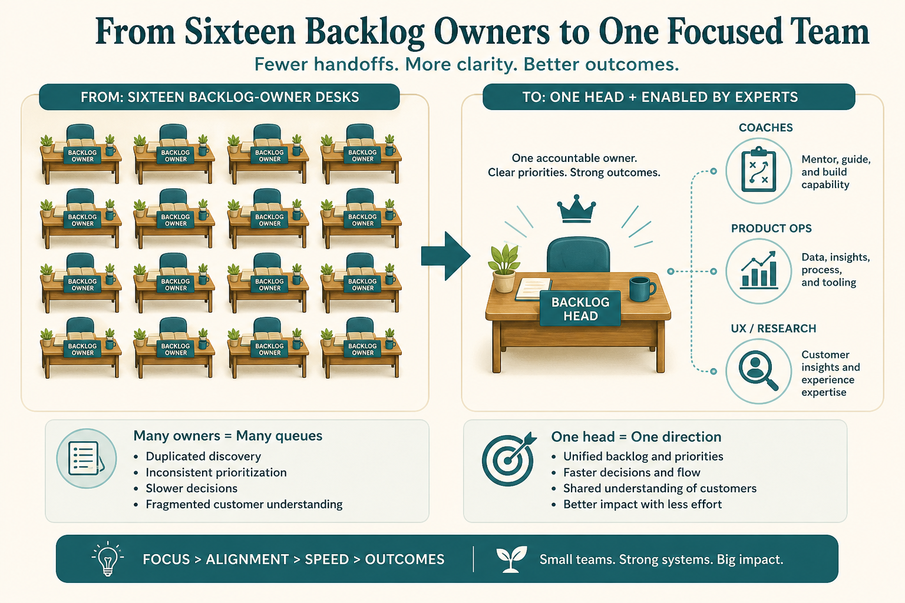

# Fewer PdMs, more product thinking

**Source:** John Cutler (@johncutlefish)
**Post:** https://x.com/johncutlefish/status/1214111022744621063

## What it claims

A 120-dev/designer company dropped 16 PdMs + 2 directors + 1 head to 1 head, 3 product coaches, 2 product ops, and more UX/UXR/data science. Teams could already run with missions; it was one product, not 16; UX+eng leads were strong partners; PM career path was weak. Coaches spread product thinking; ops moved information; UX/UXR/data improved decision quality.

## Why it matters for a PO

Product headcount ≠ product capability. Spreading thinking and raising decision quality can beat adding another backlog owner.

## 3 takeaways

1. Sixteen PdMs on one product is structure, not a win.
2. Coaches / ops / research are different levers.
3. If teams can run missions, the PO job is leverage.

## Practice this week

Map who supplies thinking, information flow, and decision quality; fill one gap without adding a backlog column.
