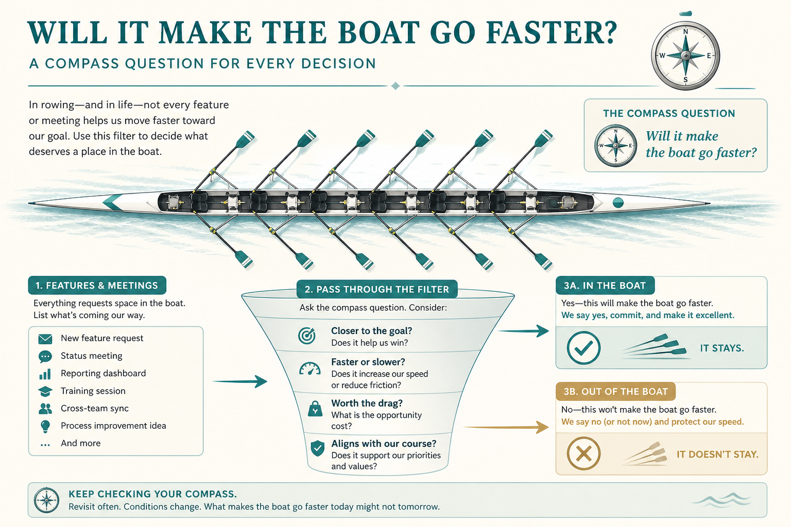

# Will it make the boat go faster?

**Source:** Shreyas Doshi (@shreyas)
**Post:** https://x.com/shreyas/status/1365732851732209668

## What it claims

British 2000 men’s eight used “Will it make the boat go faster?” on workouts, pub, routines, breakfast. Shreyas’s local version for an early-category product: “Will it make our lead much bigger?” Run features, meetings, and roadshows through one compass. Do not frame it as the uncontrollable end outcome; frame it as controllable work toward that outcome.

## Why it matters for a PO

A single compass beats a scoring zoo for saying no.

## 3 takeaways

1. One stage-specific compass.
2. Controllable work, not the end outcome.
3. Context picks the wording.

## Practice this week

Write the boat question on the backlog; kill or defer three failing items including one meeting.
