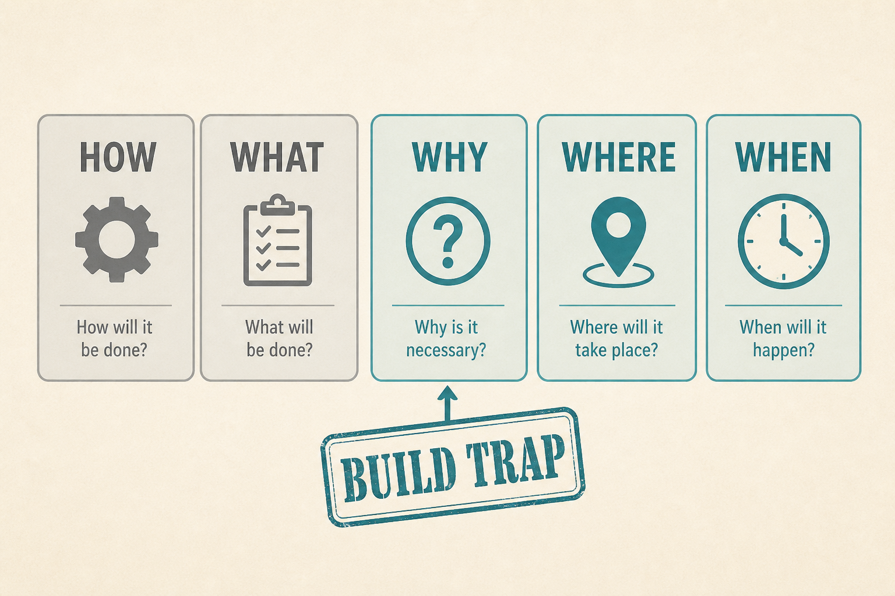

# Don’t skip WHY / WHERE / WHEN

**Source:** Pavel A. Samsonov (@PavelASamsonov)
**Post:** https://x.com/PavelASamsonov/status/1098233765783060481

## What it claims

PMs separate how/what and forget WHY (user value), WHERE (experience context), WHEN (value + validation, avoid scrumfall). No WHY → Build Trap (output, no behaviour change); MVPization then clobbers remaining value. No WHERE → mandatory inputs users cannot give. WHEN is a test schedule; later validation costs more. Without WHY, WHAT is HIPPO-defined. UX is not only “how”; latency, errors, security are UX.

## Why it matters for a PO

Stories that stop at WHAT/HOW are a feature factory with nicer cards.

## 3 takeaways

1. Missing WHY is the Build Trap.
2. WHERE is workflow context.
3. WHEN is validation, not just a date.

## Practice this week

Fill WHY/WHERE/WHEN on the next three items; block any that cannot.
