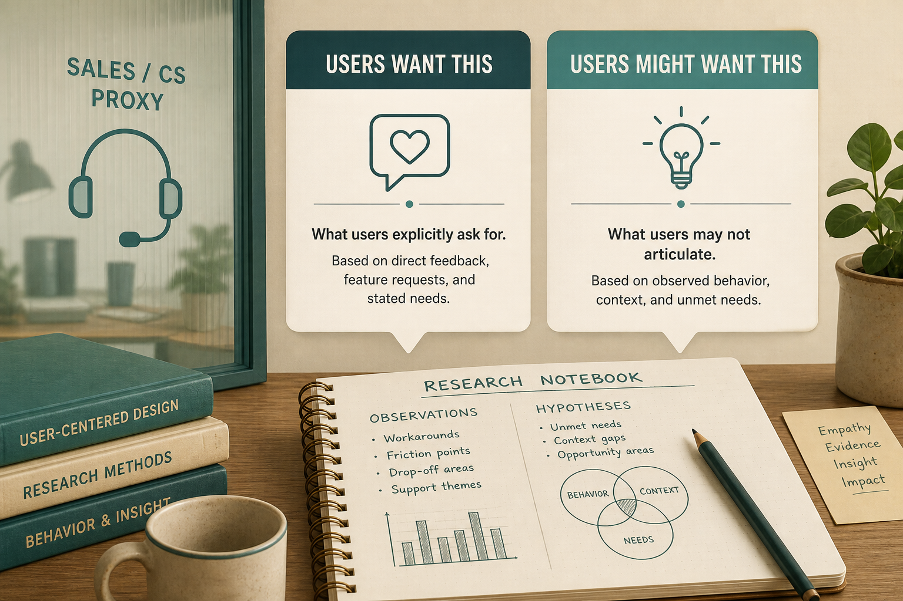

# Sales/CS are user proxies, not research

**Source:** Pavel A. Samsonov (@PavelASamsonov)
**Post:** https://x.com/PavelASamsonov/status/1145806072046919681

## What it claims

Vital to distinguish “users want this” from “users might want this.” CS/Sales have customer experience but do not build personas/use cases or document what product needs; they say “clients do all kinds of stuff,” which inflates edge-case specs. Involve them, don’t end research there. A CS breakdown report (wanted / right way / actually did / time / expertise / quote) helps; full-time researchers remain irreplaceable. Start with Hall Just Enough Research and Spool/UIE.

## Why it matters for a PO

Anecdotes feel like evidence and bloat the spec.

## 3 takeaways

1. Proxy ≠ research.
2. Unstructured proxy input → edge-case architecture.
3. Breakdown reports are a stopgap.

## Practice this week

Rewrite one “customers want X” as a breakdown or mark it unverified.
