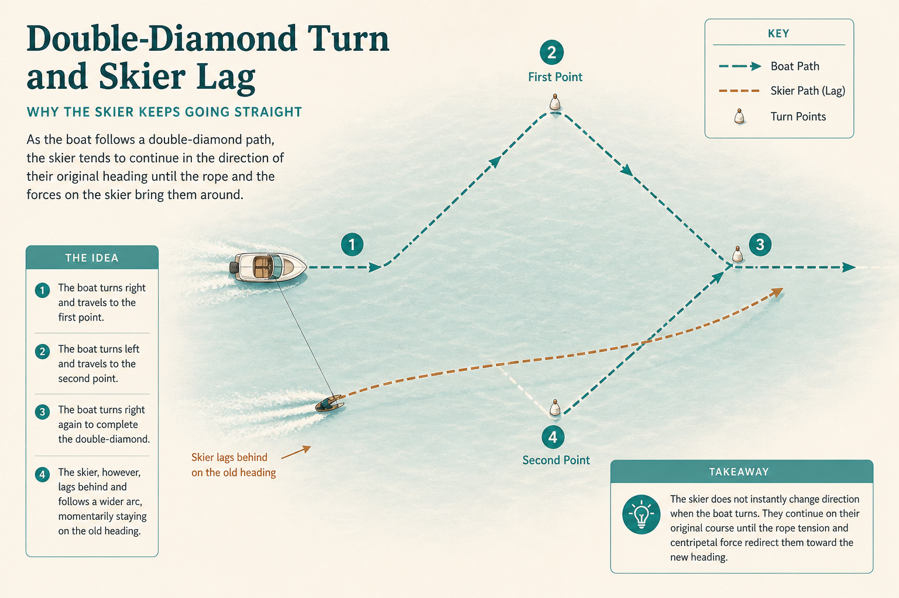

# Stakeholder momentum lags the double diamond

**Source:** Pavel A. Samsonov (@PavelASamsonov)
**Post:** https://x.com/PavelASamsonov/status/1162464928814501888

## What it claims

Designer/PO is the boat; stakeholder is a water skier. When the process turns (diverge/converge), they keep going. Stakeholders default to BAU while you diverge; they cling to pet ideas when you need to decide. After disconfirming results they may still be sliding toward ship. Tighter loops help; they never point exactly the same way. Substitute PM/ops for “design” if that’s who does this work.

## Why it matters for a PO

Facilitating the turn is the job; one workshop will not catch them up.

## 3 takeaways

1. Expect lag; repeat.
2. Convergence means dropping pet ideas.
3. Plan the turn after negative results.

## Practice this week

Name whether you are diverging or converging; tell stakeholders what to stop and what decision is due.
