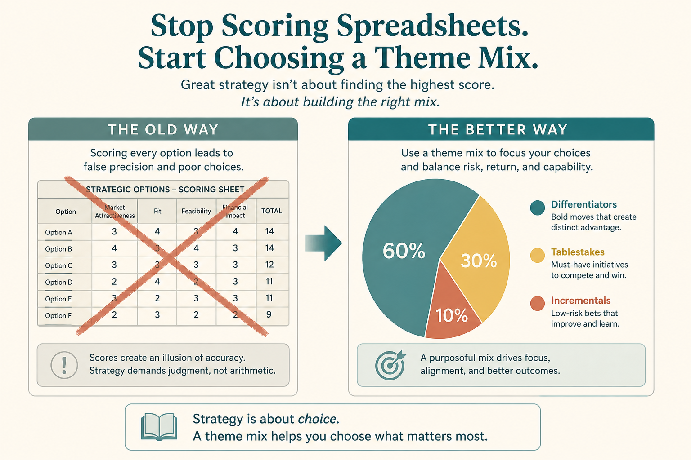

# Prioritization problems are strategy problems

**Source:** Shreyas Doshi (@shreyas)
**Post:** https://x.com/shreyas/status/1320105221570228224

## What it claims

Four strategy failures: Acceptance, Creation, Substance, Communication. Fix those first. Then allocate themes for 3/6/12 months. Single-product themes: Differentiators, Tablestakes, Incrementals, Embarrassments, Customer Specials, Speculative Bets, Tech Foundation. Example mix: 60/30/10. Judgment via questions, not a spreadsheet. Share org-level mix, then bottoms-up. RICE is fine if items are concrete and the mix remains the compass.

## Why it matters for a PO

Scoring tickets cannot replace an unshared strategy.

## 3 takeaways

1. Diagnose the four strategy problems.
2. Publish a theme mix.
3. RICE is a tool, not the strategy.

## Practice this week

Name the strategy problem; draft quarter allocation; map current WIP to it.
